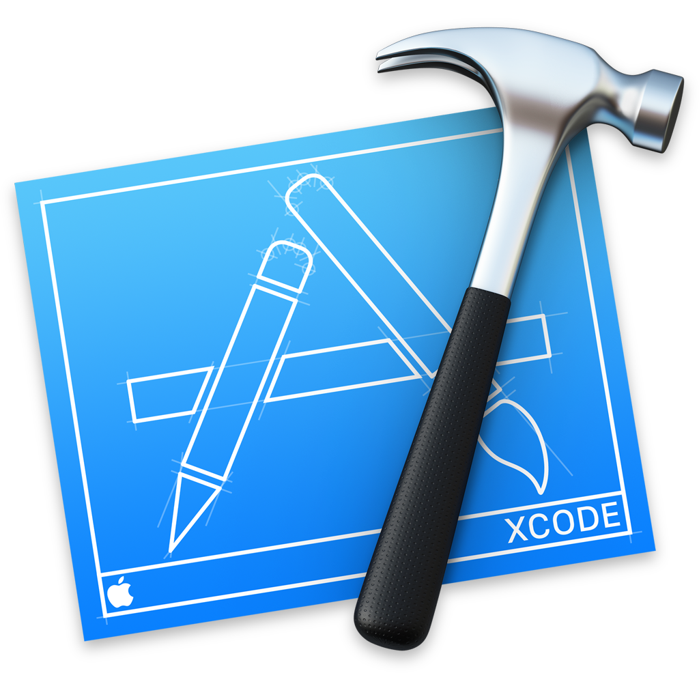
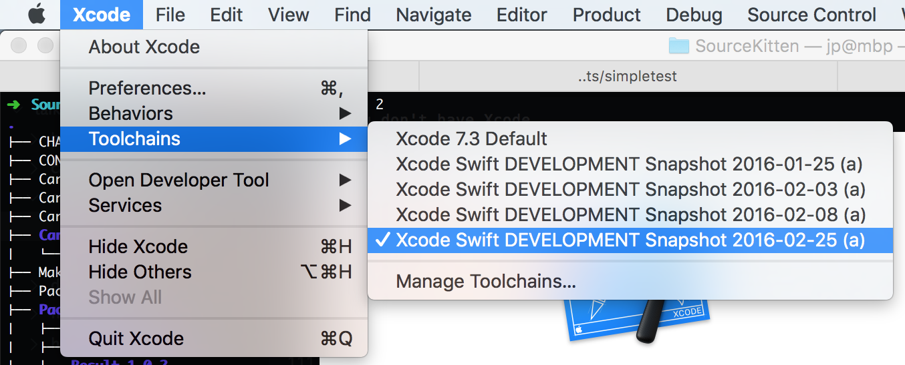

slidenumbers: true

# [fit] Cross-Platform
# [fit] *Swift*

#### JP Simard – @simjp – try! Swift – Tokyo – March 2, 2016

^
Welcome to try! Swift. My name is JP and I'll be sharing some tips on how to develop for cross-platform Swift.
Not to write code that just runs on a Linux server. Or just embedded in an Android app. But that can span multiple platforms.

---


^
I work at Realm, a mobile database that's embraced Swift since the very beginning.

---

Jazzy & SwiftLint


^
Realm is also behind projects like SwiftLint and Jazzy, so we have all the more interest in making all those projects available on all the platforms Swift supports.

---


^
So naturally when Swift was open sourced, we knew this would be a big opportunity. We've been following its progress closely, even contributing back to a few of the projects.

---

## We'll go over...

* Development Environment
* Swift Package Manager
* Testing
* Continuous Integration

^
In this talk, we'll go over these things.

---

# Exactly
# [fit] *2*
# Platforms

^
Only Darwin & Linux 64-bit are currently supported.

---

# Exactly
# [fit] *3*
# Platforms

^
Except the Darwin platform is fragmented between Xcode & OSS Swift

---

# Exactly
# [fit] *3-ish*
# Platforms

^
Except other platforms more or less work too: Raspberri Pi (armv7), FreeBSD, Android, etc.

---


^
So Swift was just open sourced, you jump in and rewrite everything in the world to use it.
Going from old and busted to new hotness.

---

## **Expectation**


^
You think you'll write all this code.

---

## **Expectation**


^
Be even more productive using your language of choice for servers...

---

## **Expectation**


^
Scripts...

---

## Reality


^
But then you realize that you don't have Grand Central Dispatch...

---


^
You don't have Xcode...

---


^
You don't even have the same versions of Foundation & XCTest you're used to!
Though Apple & the community is making good progress on this!

---

# :clap:
# [fit] Apple's doing a great job

---

# [fit] Early
# [fit] *Days*

^
But that's ok, it's early days

---

## Developing all from one place

* Xcode
* Xcode+Toolchain
* Docker+CLI+Editor

^
Let's take a look at what kind of setup it would take to build for all these platforms.

---

# Xcode



^
I'll assume here that you're familiar with programming in Xcode. Use this configuration for developing for Apple platforms.

---

# Xcode+Toolchain



^
Use this configuration to develop against a newer, experimental version of Swift. Select a toolchain for Xcode to use from Xcode->Toolchains.

---

# Docker+CLI+Editor

```bash
$ brew install docker docker-machine
$ docker-machine create --driver virtualbox default
$ eval $(docker-machine env default)
$ docker pull swiftdocker/swift
$ docker run -it -v `pwd`:/project swiftdocker/swift bash
---
root@445ab1838149 $ cd /project
root@445ab1838149 $ swift build & swift test
```

^
Assuming you already have Homebrew installed, this:
* Installs Docker
* Creates a Linux virtual machine
* Configures it to run Swift with the latest official snapshot
* Starts the machine with your current host directory mounted as a shared volume
This makes it easy to continue using the same environment for everything but the build commands.
So you can continue using your favorite editor, shell and even Xcode to work on this source.

---

## Swift Package Manager

> The Swift Package Manager is a tool for managing the distribution of Swift code. It’s integrated with the Swift build system to automate the process of downloading, compiling, and linking dependencies.

^
This is how you should build your OSS Swift.

---

# [fit] Use SPM *even* for
# [fit] small or private projects!

^
We'll hear from Ayaka, Jeff and other speakers at this conference about boundaries, libraries and modules. This is a really flexible way to build your code fragments.

---

## Things you'd expect to work

* `dynamic` keyword
* Casting
* Foundation
* Grand Central Dispatch
* Auto-importing of frameworks

^
Full dynamic and casting behaviors depend on the Objective-C runtime

---

# Casting has never been so difficult...

```diff
public func materialize<T>(@autoclosure f: () throws -> T) -> Result<T, NSError> {
   do {
     return .Success(try f())
-  } catch {
-    return .Failure(error as NSError)
+  } catch let error as NSError {
+    return .Failure(error)
   }
 }
```

From porting *Result* to Linux:
<https://github.com/antitypical/Result/pull/135>

^
Here's an example of fighting against cross-platform casting differences.

---

## *\#ifs* Everywhere

```swift
#if SWIFT_PACKAGE
import SomeModuleOtherwiseAvailable
#endif

#if os(Linux)
// some arcane hack
#else
// something more reasonable
#endif
```

^
This also applies when building against both the latest stable Xcode Swift version and the latest Swift snapshot, even on just OS X.

---

# [fit] *Testing*

^
Let's talk about testing

---

# :eyes: Rediscovering XCTest :eyes: 

```swift
import PackageDescription

let package = Package(
  name: "MyPackage",
  targets: [
    Target(name: "MyPackage"),
    Target(name: "MyPackageTests", // build tests as a regular target...
      dependencies: [.Target(name: "MyPackage")]), // ...that depend on the main one
  ],
  dependencies: [
#if !os(Linux) // XCTest is distributed with Swift releases on Linux
    .Package(
      // no version tags at apple/swift-corelibs-xctest, so fork it
      url: "https://github.com/username/swift-corelibs-xctest.git",
      majorVersion: 0
    ),
#endif
  ]
)
```

^
Just to give you an idea of how quickly Swift OSS is progressing, this is how you could write tests until the very latest Swift distribution, which included built-in testing support in Swift Package Manager.

---

# SPM Testing

```bash
Package.swift # can be empty in simplest configuration
Sources/
  MyPackage/
    file.swift
Tests/
  LinuxMain.swift # needs `@testable import MyPackagetest` & `XCTMain()`
  MyPackage/ # *must* be named after package being tested
    test.swift # can `import XCTest` and `@testable import MyPackage`
```

^
As of the February 25th snapshot, Swift Package Manager now has built-in support for testing. Using Darwin XCTest if available, falling back on Swift XCTest otherwise.

---

# *Much* Simplification


---

# [fit] Continuous
# [fit] *Integration*

---

# Embrace The Matrix


^
Embrace the matrix

---

# *Travis CI*


^
Here we'll look at how to set up cross-platform testing on our 3-ish platforms for Travis CI, but the same could be done with other CI systems like Jenkins or Circle CI.

---

# Travis configuration

```
matrix:
  include:
    - env: JOB=OSX_Xcode
    - env: JOB=OSX_SPM
    - env: JOB=Linux
```

^
See https://github.com/antitypical/Result/blob/master/.travis.yml for real world configuration

---

# Travis Xcode

```
script: xcodebuild test
env: JOB=OSX_Xcode
os: osx
osx_image: xcode7.2
language: objective-c
before_install: pod install / carthage update / etc.
```

^
This is how you'd typically test things...

---

# Travis OS X SPM

```
script:
  - swift build
  - .build/Debug/MyUnitTests
env: JOB=OSX_SPM
os: osx
osx_image: xcode7.2
language: objective-c
before_install: 
  - export SWIFT_VERSION=swift-DEVELOPMENT-SNAPSHOT-2016-02-25-a
  - curl -O https://swift.org/builds/development/xcode/$(SWIFT_VERSION)/$(SWIFT_VERSION)-osx.pkg
  - sudo installer -pkg $(SWIFT_VERSION)-osx.pkg -target /
  - export PATH=/Library/Developer/Toolchains/$(SWIFT_VERSION).xctoolchain/usr/bin:"${PATH}"
```

^
We need to install the Swift release before building & running our unit tests

---

# Travis Linux

```
script:
  - swift build
  - .build/Debug/MyUnitTests
env: JOB=Linux
dist: trusty
sudo: required
language: generic
before_install:
  - DIR="$(pwd)"
  - cd ..
  - export SWIFT_VERSION=swift-DEVELOPMENT-SNAPSHOT-2016-02-25-a
  - wget https://swift.org/builds/development/ubuntu1404/$SWIFT_VERSION/$SWIFT_VERSION-ubuntu14.04.tar.gz
  - tar xzf $SWIFT_VERSION-ubuntu14.04.tar.gz
  - export PATH="${PWD}/${SWIFT_VERSION}-ubuntu14.04/usr/bin:${PATH}"
  - cd "$DIR"
```

^
We need to install the Swift release before building & running our unit tests

---


^
Once you've got all of this set up, you'll feel pretty good!

---

# [fit] Early
# [fit] *Days*


^
In the meantime, we just have to work with what we have while Swift language contributors sort this out.

---

# [fit] *どうもありがとう*
# Thank You!

#### JP Simard – @simjp – try! Swift – Tokyo – March 2, 2016
