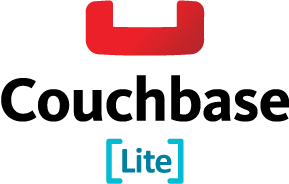

^Notes
- Great to be here
- Big thanks to Luis & Borja

---

# [fit] A _**Brief**_

---

# [fit] _**Incomplete**_

---

# [fit] Mostly
# [fit] _**Wrong**_

---

## A _**Brief**_, _**Incomplete**_, & Mostly _**Wrong**_

# [fit] History of
# [fit] Databases
# [fit] on iOS

^Notes
- picked title because topic something iOS devs think about too much
- hard to find info
- I see you're all on the edge of your seats. It's exhilarating

---

## Let's face it
# [fit] Databases
# [fit] are boring

^Notes
- So I added Michael Bay-style explosions throughout the talk to keep you entertained and awake

---

^Notes
- Here's one. Wait for it...

---

# [fit] Me
## JP Simard
## @simjp
## jp@realm.io

---

^Notes
- I work at Realm, new database, launched on iOS two months ago, Android coming in a few weeks
- When I started, I was interested in the backstory as to why there are so few reasonable options

---

# [fit] iOS
# [fit] State Of
# [fit] Persistence

^Notes
- To look at history, let's start where we are today

---

* NSKeyedArchiver/plists/files
* SQLite/FMDB*
* FCModel*
* Core Data*
* YapDatabase*
* CouchbaseLite*
* LevelDB/MongoDB & other backend ports
* Realm

_**\* Built on SQLite**_

^Notes
- No particular order
- Mostly all using SQLite under the hood
- Won't cover straight files or ports
- Ports are pretty esoteric: not app development conscious, poor performance

---

^Notes
- Lots of choice and innovation on backend
- Bottom only has SQLite in 2000 and Realm in 2014

---

---

# [fit] SQLite

---

# SQLite

* Main author: Richard Hipp
* Released v1 in 2000
* Released v3 in 2004
* Currently v3.8.6
* v4 was announced in 2012, but was never publicly updated
* Led by consortium of Adobe, Bloomberg, mozilla & Oracle

^Notes
- Actually, I have a question for you...

---

# Q: What was SQLite
# [fit] designed
# for?

^Notes
- Or, put another way...

---

# Q: What's the
# [fit] **biggest**
# [fit] **thing**
# ever to have run SQLite?

^Notes
- Or, put another way...

---

# Q: What's the
# [fit] **scariest**
# [fit] **thing**
# ever to have run SQLite?

---

^Notes
- This thing
- Is that an iPhone?
- Nope. SQLite was designed to run on freaking missile destroyers

---

# [fit] Freaking

---

# [fit] Freaking
# [fit] Missile

---

# [fit] Freaking
# [fit] Missile
# [fit] Destroyers

^Notes
- OK, this is getting too intense, maybe Michael Bay explosions were a bad idea
- Let's try something cuter

---

---

# SQLite

* Designed for **guided missile destroyers** for the US Navy
* Bedrock of iOS persistence
* Relational, embedded, ACID, SQL-like
* Public domain
* _**[sqlite.org](http://www.sqlite.org)**_

^Notes
- Now let's look at some awesome stuff that was built on top of SQLite over the years

---

# FMDB

* Popular Objective-C SQLite wrapper
* Written by Gus Mueller of Flying Meat Software
* Gus built this for accessing SQLite in his apps (VoodooPad & Acorn)
* Adds 10%-20% performance overhead over raw SQLite
* _**[github.com/ccgus/fmdb](https://github.com/ccgus/fmdb)**_

---

# FCModel

* Recent (2013) SQLite ORM in Objective-C
* An alternative to Core Data for people who like having direct SQL access
* Written by Marco Arment of Instapaper and Overcast
* Uses FMDB under the hood
* Models defined directly as classes and properties
* _**[github.com/marcoarment/FCModel](https://github.com/marcoarment/FCModel)**_

^Notes
- Uses lots of runtime introspection to detect how models are defined
- Realm uses a similar approach

---

# Core Data

* By far most popular persistence choice on iOS
* Released in 2005 for OSX 10.4 Tiger & 2009 for iOS SDK 3.0
* Evolved from Enterprise Objects Framework (EOF)

^Notes
- Let's take a few steps back to EOF

---

# Enterprise Objects Framework

* ORM for Microsoft SQL Server & Oracle in early 90's (92-94)
* Built by team at NeXT in Objective-C for OpenStep
* Starting point for Core Data
* Worked on by Craig Federighi, a.k.a. Hair Force One

---

# YapDatabase

* Key-Value Store built on SQLite
* Built by Robbie Hanson of Yap Studios
* _**[github.com/yapstudios/YapDatabase](https://github.com/yapstudios/YapDatabase)**_

---

# Couchbase Lite

* Evolved from TouchDB
* Apache CouchDB compatible
* Now at Couchbase
* NoSQL-like, built on SQLite
* Lightweight, embedded, syncable, NoSQL-like

^Notes
- That wraps up the SQLite wrappers...
- Let's celebrate with a short Michael Bay action flick

---

^Notes
- This brings us to the first, really the only storage engine ever designed for modern smartphones

---

---

# [fit] Realm Genesis

---

# Realm Genesis

* Alexander Stigsen at Nokia early 2000's
* Need to fit data on very limited devices. Low storage, memory & processing power
* Compression not an option
* Solution: Intelligent bit-packing, ARM vectorization, efficient table layout
* YCombinator S11, Launched on iOS 2014

---

# Realm

* **Fast, embedded database** (zero-copy, not an ORM)
* **True NoSQL** (not just interface)
* **Full ACID transactions**
* **Well defined threading model** (GCD)
* **Cross-platform C++ core with many language bindings** (only Objective-C & Swift released)

---

# Open Source

# [fit] 

## [github.com/realm/realm-cocoa](https://github.com/realm/realm-cocoa)

^Notes
- Just about wraps up the talk. I'd like to leave you with some resources and final thoughts.

---

# Resources

* This talk: _**[github.com/jpsim/talks](https://github.com/jpsim/talks)**_
* SQLite: _**[The Definitive Guide to SQLite](http://www.amazon.com/Definitive-Guide-SQLite-Mike-Owens/dp/1590596730)**_ & _**[SQLite 4 Design](http://sqlite.org/src4/doc/trunk/www/design.wiki)**_
* Core Data: _**[History and Genesis](http://en.wikipedia.org/wiki/Core_Data#History_and_genesis)**_
* Enterprise Objects Framework (EOF): _**[EOF History](http://en.wikipedia.org/wiki/Enterprise_Objects_Framework#History)**_
* Realm: _**[realm.io](http://realm.io)**_
* Michael Bay Gifs: _**[r/michaelbaygifs](http://www.reddit.com/r/michaelbaygifs)**_

---

^Notes
- Lots of choice and innovation on backend
- Bottom only has SQLite in 2000 and Realm in 2014
- Let's continue to build options on the lower chart
- More tools can only help us

---

# Let's Build Better Tools Together

^Notes
- Let's stop trying to use the same tool to solve every problem
- More tools can only help us
- I kept the best gif for last

---

---

# [fit] _**Gracias!**_
# [fit] @simjp, jp@realm.io
