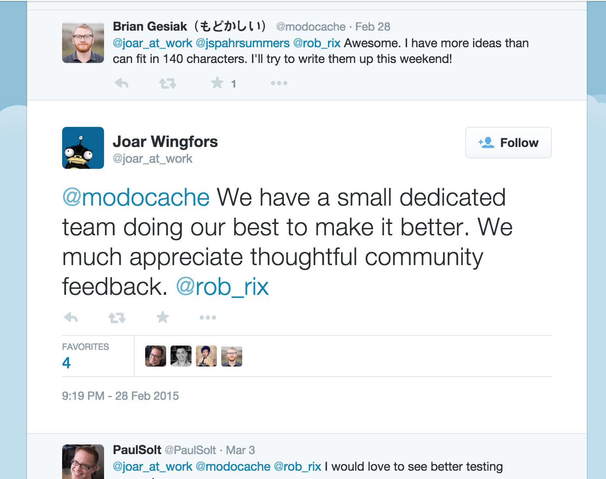
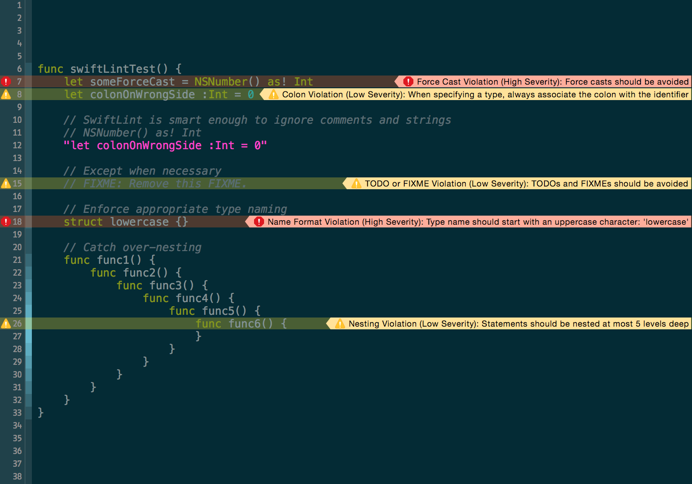

slidenumbers: true

# [fit] Fixing the
# [fit] **Swift Tooling**
# [fit] Problem

### JP Simard, @simjp, realm.io

^
A common complaint about Swift is that the tooling doesn't live up to the promise of the language.
Let's look at what the problem is and how we can fix it.

---

^
I work on a mobile database for iOS and Android called Realm.
We wanted to embrace Swift right as soon as it was announced, but the tools were lacking...

---

^
When it was announced, it was introduced as the future.
An evolutionary step.

---

^
We were promised simplicity.

---

^
We were promised safety.

---

^
We were promised time traveling blimps.

---

^
Instead we got this. When we started working with it, once the hype toned down...
as ObjC developers, we started trying to do "real work", and noticed all the holes.

---

# [fit] What's the Problem?

---

# Tangible Problems

- Missing Tools
- Incomplete Tools
- Buggy Tools

---

# [fit] Apple is *very* private.

---

# [fit] Apple is *too* private.

---

# [fit] Apple releases new tools *yearly*.

---

# [fit] Apple is focused on *different* things.

---

# [fit] *"Only Apple can do this"*

## – The Lazy Developer

^
There's this mentality that only Apple can really fix our tools.
So there's a tendency to just accept and cope by complaining on twitter.

---

^
The problem is that our tools let us down, and we feel helpless to change things.

---

# [fit] What do other communities do?

---

# A: Mix of vendor-provided tools and community projects

^
javadoc was developed at Oracle, godoc by the GoLang team
but rdoc and yard were developed by independents

---

# [fit] What's Missing in Swift?

---

# [fit] *Lots!*

---

# What Tools are Missing in Swift?

- Package Manager
- Refactoring Tools
- Automatic Code Style Detection & Enforcement
- Documentation Generator
- Version Manager
- Fuzzy Testing

---

# Thanks {$COMMUNITY}!

- Package Manager (**CocoaPods** & **Carthage**)
- Refactoring Tools (**AppCode**)
- Automatic Code Style Detection & Enforcement (**SwiftLint**)
- Documentation Generator (**jazzy**)
- Version Manager (**chswift**)
- Fuzzy Testing (**SwiftCheck**)

---

# Opportunities

- Code Generation (???)
- Test Coverage Generation (???)
- Static Code Analysis (???)
- Instrumentation (???)
- LLVM IR Manipulation (???)

^
Those question marks are opportunities.

---

# [fit] How can we add it back in?

---

# [fit] Lots
# [fit] of Reverse Engineering

---

# [fit] Hopper.app

---

# [fit] class-dump

---

# [fit] Xcode Plugins

---

# [fit] Clang

^
OCLint is a good example for Objective-C

---

# [fit] SourceKit

^
Private framework Apple uses for source code support in Xcode

---

# [fit] AppCode

## Supported Plugin Architecture

^
The developers of AppCode are here at UIKonf. An important point is that...

---

# [fit] Apple's No
# [fit] *Different*
# [fit] Than Us!

^
Xcode's just as messy on the inside as it is from the outside.
Just a pile of plugins.

---

# [fit] well...

---

# [fit] Risk

^
Swift is a moving target. These solutions may be temporary and we'll redo this work when Swift 2.0 is inevitably released.

---

^
Or Apple may Sherlock you.

---

^
General advice: avoid placing big bets on projects with uncertain futures.

---

# [fit] We can *help* Apple

---

^
Work with Apple. Make them aware of our issues.

---

^
It's difficult to interact with Apple people, but it's clear they're willing.

---

# [fit] What The
# [fit] Community
# [fit] Has Done

---

^
AppCode

---

^
SwiftDoc.org

---

^
CocoaPods

---

# **Carthage**

^
Carthage

---

# [fit] SourceKitten

^
SourceKitten

---

^
Jazzy

---

^
Jazzy

---

# [fit] SwiftLint

---

^
SwiftLint

---

# [fit] Leverage the community

^
Lots of tool creators in the room today:
- Brian Gesiak
- Marius Rackwitz
- AppCode team
- Facebook team

---

# Resources (1/2)

- Swift Compiler Crashes: [github.com/practicalswift/swift-compiler-crashes](https://github.com/practicalswift/swift-compiler-crashes)
- Carthage: [github.com/Carthage/Carthage](https://github.com/Carthage/Carthage)
- CocoaPods: [cocoapods.org](https://cocoapods.org)
- SwiftCheck: [github.com/typelift/SwiftCheck](https://github.com/typelift/SwiftCheck)

---

# Resources (2/2)

- AppCode: [jetbrains.com/objc](https://www.jetbrains.com/objc)
- chswift: [github.com/neonichu/chswift](https://github.com/neonichu/chswift)
- SwiftDoc: [swiftdoc.org](http://swiftdoc.org)
- jazzy♪♫: [github.com/realm/jazzy](https://github.com/realm/jazzy)
- SwiftLint: [github.com/realm/SwiftLint](https://github.com/realm/SwiftLint)

---

# [fit] Go Forth
# [fit] *and*
# [fit] **Build!**

---

# [fit] `UIKonf().questions.ask()!`

## JP Simard, @simjp, realm.io

