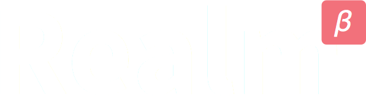
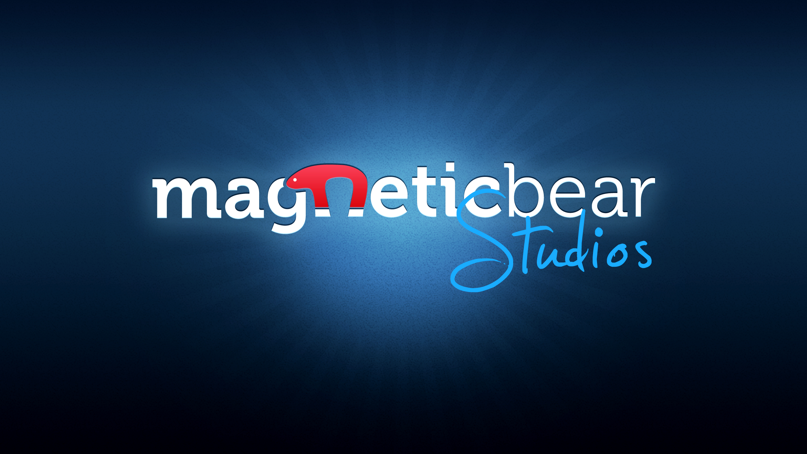
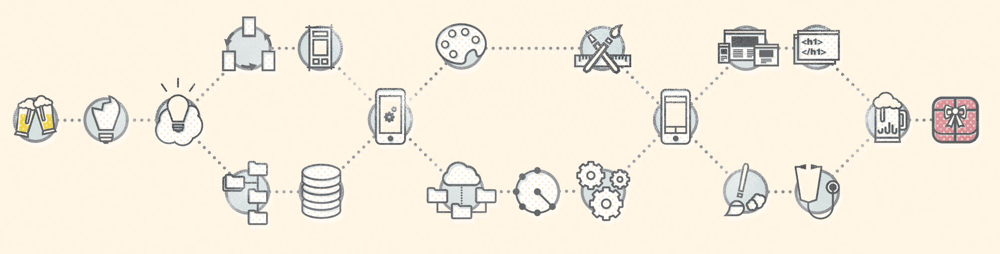
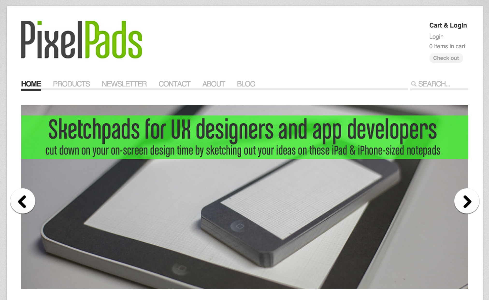
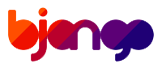
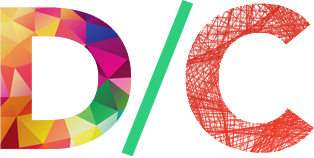
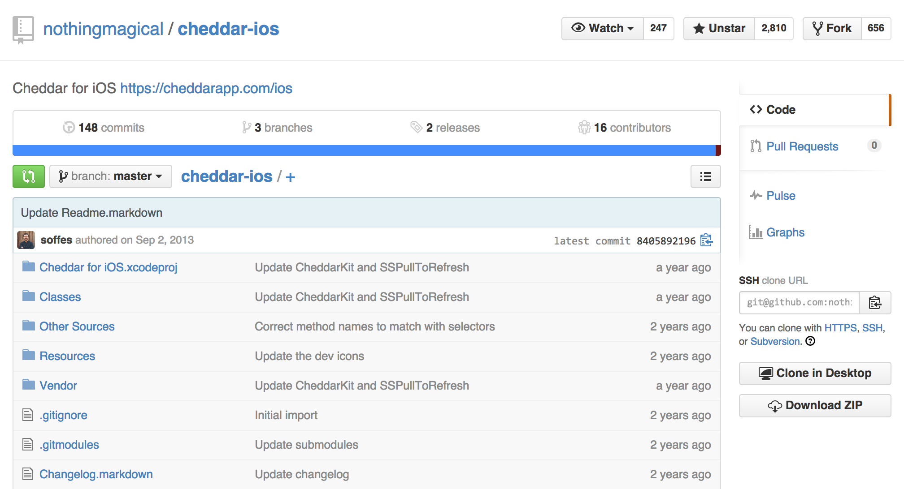

# [fit] How Do I App?

# *Code not included*

---

# My Biggest Issues Starting Out

* Where do I start?
* Everyone's flow is different
* What tools should I use?
* What books should I read?
* No correct/incorrect answer

---

# [fit] FLOW

^Notes
- This talk is about flow

---

# 

## Modern Database for iOS

---

^Notes
- Built lots of apps and refined a process

---

# [fit] These slides are *wrong*

^Notes
- Wrong in the sense that they're not the only way
- Why no one gives talks like these
- Eugene's talk: just pick something and run with it

---

# [fit] **Process**

---

^Notes
- Broken Idea
- Refined Idea
- Architecture
- UX Prototype
- Pixel Design
- App Functionality
- Iterate
- Polish: website/optimization/user feedback
- Ship It

---

^Notes
- Most important part is shipping

---

# App Checklist

*1.* Idea
*2.* User Stories
*3.* Screen Sketches
*4.* Design
*5.* UX Prototype
*6.* UI Prototype

^Notes
- Could be a talk in itself
- Should do all these steps throughout the process

---

# App Checklist (cont'd)

*7.* Functional Offline Prototype
*8.* Build App (draw rest of the owl)
*9.* Lots of iteration & testing
*10.* Ship It!

^Notes
- Could be a talk in itself
- Should do all these steps throughout the process

---

# [fit] 1. Idea

---

# 1. Finding the Idea

* Any time someone says "X" totally sucks
* Any time *you* say "Y" could be way better
* Talk to your (potential) users
* Hacker News: *Idea Sunday*

^Notes
- Dasmer's presentation: talk to your users

---

# [fit] 2. User Stories

---

# 2. User Stories

* About refining the idea
* Not about what should the app do
* About what a user should be able to do with the app
* About Focus

---

# [fit] 3. Screen Sketches

---

# 3. Screen Sketches

* About flow of the app
* About accomplishing the goals from 2 on screen
* PixelPad, Sketch.app, Briefs.app, OmniGraffle, Illustrator, +++

---

---

# Pro Tip #1726
# *Staple your sketches together*

---

# [fit] 4. Design

---

# 4. Design

* Pixel design, brand identity
* Read Bjango's iOS design articles: **bjango.com**
* Read Design Then Code: **designthencode.com**

#  

^Notes
- Work with a designer or learn yourself
- Marc Edwards & Mike Rundle

---

# [fit] 5. UX Prototype

---

# 5. UX Prototype

* Stick your sketches directly into storyboards
* Make sure your elements fit on screen and the flow is intuitive
* Give it to users and tell them to do tasks from #2

---

# [fit] 6. UI Prototype

---

# 6. UI Prototype

* Where you take your high-def photoshop/sketch mock ups and **implement the UI**
* Look like it's fully working but **doesn't actually do anything**
* Read-only
* Give it to your users and **see how they use it**
* Be **creepy** and look over their shoulder

---

# [fit] 7. Functional Offline Prototype

---

# 7. Functional Offline Prototype

* Hardcode API responses
* Nocilla, OHHTTPStubs
* Useful for demos with canned data or when API breaks

---

# [fit] 8. Build App
# *draw rest of the owl*

---

# 8. Build App

* Build in the business logic
* The API client
* Implement MultipeerConnectivity
* Everything
* Once you have the skeleton of your app, this should be **super easy**

---

# [fit] 9. Lots of iteration & testing

---

# 9. Lots of iteration & testing

---

# [fit] 10. Ship It!

---

# 10. Ship It!

* Keep your finger on the **pulse**
* **Talk** to your users often
* Use analytics to **understand** what your users aren't telling you

---

# Project Structure

---

## liftoff

---

# [fit] Watch WWDC videos

## *Pay attention to what the title doesn't say*

---

# The Power of *Open*

---

# Get chummy with this guy:

---

# Open Source is your friend

* Download and build open source apps
* Tweak them
* Use CocoaPods to build parts of your app*
* Use CocoaPods to see how **others** have built things

-

\* Don't use something you don't understand

^Notes
- Danny said this

---

# Cheddar

^Notes
- Cheddar by Sam Soffes was a great resource to learn to build an app from A-Z

---

# [fit] `ASwiftStart().questions?.askThem!!`

# ____________

## speakerdeck.com/jpsim/how-do-i-app
## JP Simard, *[@simjp](https://twitter.com/simjp)*, *[realm.io](http://realm.io)*
