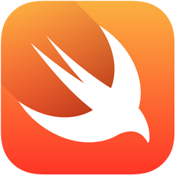

# How do I even
# [fit] **Swift?**



^Notes
- Thanks for coming!
- Goal not to make you masters
- Goal to give you a sense its design philosophy

---

# Who *am* I?

---

# JP Simard
## *[@simjp](https://twitter.com/simjp)*
## *[realm.io](http://realm.io)*


^Notes
- Work at Realm, a fast database for Objective-C & Swift
- Work on ObjC binding, and Swift almost full time since WWDC

---

# [fit] 

### [github.com/realm/*realm-cocoa*](https://github.com/realm/realm-cocoa)

---

# Why Swift > ObjC?

* Optionals
* Type safety & inference
* Closures
* Tuples
* Super-Enums & their pattern-matching sidekick
* Functional programming
* Generics

^Notes
- Finally, some modern language features!

---

# Q: What does it *look* like?

^Notes
- Notice the languages that may have inspired this at the bottom

---

# Optionals

---


^Notes
- ObjC: check nil before doing anything

---

# Optionals

```swift
let possibleNumber = "123"
let convertedNumber = possibleNumber.toInt()
// convertedNumber is inferred to be of type "Int?", or "optional Int"

if convertedNumber != nil {
  println("convertedNumber: \(convertedNumber!)")
}

if actualNumber = convertedNumber { // optional binding
  println("actualNumber: \(actualNumber)") // => not an optional
}
```

---

# Type *safety* & *inference*

```swift
let anInt = 3
let aDouble = 0.1416
var pi = anInt + aDouble // Compile warning

pi = 3 + 0.1416
// Compiles: number literals are untyped
```

## Like Rust & Scala

^Notes
- Read through comments

---

# Closures

```swift
func backwards(s1: String, s2: String) -> Bool {
  return s1 > s2
}
sort(["b", "a"], backwards) // => ["a", "b"]
```

## Swift Closures :point_right: ObjC Blocks

^Notes
- capture and store references to variables and constants

---

# Tuples

```swift
let http404Error = (404, "Not Found")
```

## Like Haskell & Scala

^Notes
- Notice the wonderful type inference at play here

---

## Super-Enums\* & their pattern-matching sidekick

### <sub>\*Ok, not exactly the *correct* technical term</sub>

---

# Super-Enums\*

```swift
enum Suit: String {
    case Spades = "Spades",
    Hearts = "Hearts",
    Diamonds = "Diamonds",
    Clubs = "Clubs"
}

let card: (Suit, UInt) = (.Spades, 1)
card.0.toRaw() // => "Spades"
```

^Notes
- Enums in Swift are their own type

---

# Pattern matching

```swift
let card: (Suit, UInt) = (.Spades, 1)
switch card {
  case (let suit, 1):
    println("Ace of \(suit.toRaw())") // => Ace of Spades
  case (let suit, let number):
    println("\(number) of \(suit.toRaw()")
}
```

---

# Functional programming

```swift
let numbers = [1, 2, 3, 4]
numbers.map {
    (number: Int) -> Int in
    return 3 * number
} // => [3, 6, 9, 12]
numbers.filter {$0 % 2 == 0} // => [2, 4]
```

## Like Haskell, Scala & many others

^Notes
- There's a lot more than functional concepts in this slide:
- type inference and closures to name a few

---

# Generics

### Like... uh... *every* modern language!

---

```swift
// Reimplement the Swift standard 
// library's optional type
enum OptionalValue<T> {
  case None
  case Some(T)
}
var maybeInt: OptionalValue<Int> = .None
maybeInt = .Some(100)

// Specialized Array
var letters: [Array]
letters = ["a"]
```

---

## Q: What happened to my beloved
# _\*_

---

### Q: What happened to my beloved _\*_?

* *concepts* are still there: reference types and value types
* pointers still exist to interact with C APIs: `UnsafePointer<T>`, etc.

---

### Q: What happened to my beloved _\*_?

#### C APIs are still usable

```swift
import Foundation
import Security

let secret = "Top Secret".dataUsingEncoding(NSUTF8StringEncoding)
let dict = [kSecClass as String: kSecClassGenericPassword,
    kSecAttrService as String: "MyService",
    kSecAttrAccount as String: "Some Account",
    kSecValueData as String: secret] as NSDictionary
let status = SecItemAdd(dict as CFDictionaryRef, nil)
```

^Notes
- Sometimes if feels good to ditch C

---

### Q: That's cool, but how do I even...

^Notes
- When do I use it?
- How do I interact with C/ObjC?
- How do I interact with C++?
- How do I generate docs?

---

### Q: That's fine, but

# When do I *use* it?

---

# When to use Swift

* New apps
* Personal projects
* Scripts
* Bribe your boss to use it in production\*

<sub>\* I am not liable</sub>

---

### Q: That's fine, but

## How do I interact with *C/ObjC*?

---

# Interacting with C/ObjC

* `UnsafePointer<T>` is typed `COpaquePointer`
* `UnsafeMutablePointer<T>`

```swift
var aString = "Barcelona"
withUnsafePointer(&aString) { (arg: UnsafePointer<String>) in
    println("Hello " + arg.memory) // => Hello Barcelona
}
```

---

### Q: Sure, but

### [fit] How do I interact with *C++*?

---

### [fit] Q: Sure, but how do I interact with *C++*?
## A: Don't!

## <sub>use Objective-C++ wrappers</sub>

---

# Q: How do I even generate docs?

---

# jazzy<sup>♪♫</sup>

### [fit]  *[github.com/realm/jazzy](https://github.com/realm/jazzy)*

#### [fit] a soulful way to generate docs for Swift & Objective-C

---


---

# Links (**)

* *[Official Swift blog](https://developer.apple.com/swift)*
* *[The Swift Programming Language Book](https://developer.apple.com/library/prerelease/ios/documentation/Swift/Conceptual/Swift_Programming_Language/)*
* *[WWDC Videos](https://developer.apple.com/videos/wwdc/2014)*
* *[WWDC Sample Code](https://developer.apple.com/wwdc/resources/sample-code)*
* *[Xcode 6](https://developer.apple.com/downloads)* (and other resources)

<sub>Free Apple Developer Account Required</sub>

---

# Links (*!*)

* This talk: *[github.com/jpsim/talks](https://github.com/jpsim/talks)*
* Other Swift talks: *[realm.io/news](http://realm.io/news)*
* Airspeed Velocity: *[airspeedvelocity.net](http://airspeedvelocity.net)*
* ObjC/Swift doc generator: *[github.com/realm/jazzy](https://github.com/realm/jazzy)*
* Swift on *[StackOverflow](http://stackoverflow.com/questions/tagged/swift)*

---

# Thank You!

---

# [fit] `Meetup().questions?.askThem!!`

---

# [fit] `Meetup().questions?.askThem!!`

### JP Simard, *[@simjp](https://twitter.com/simjp)*, *[realm.io](http://realm.io)*
