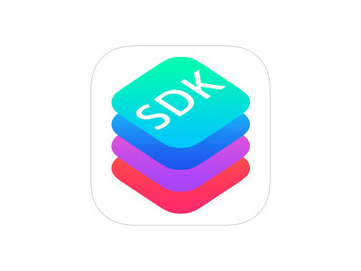
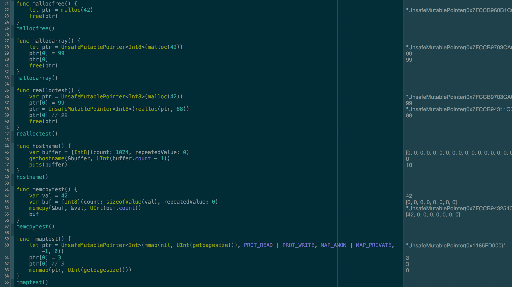
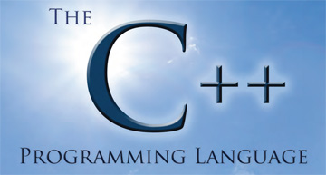
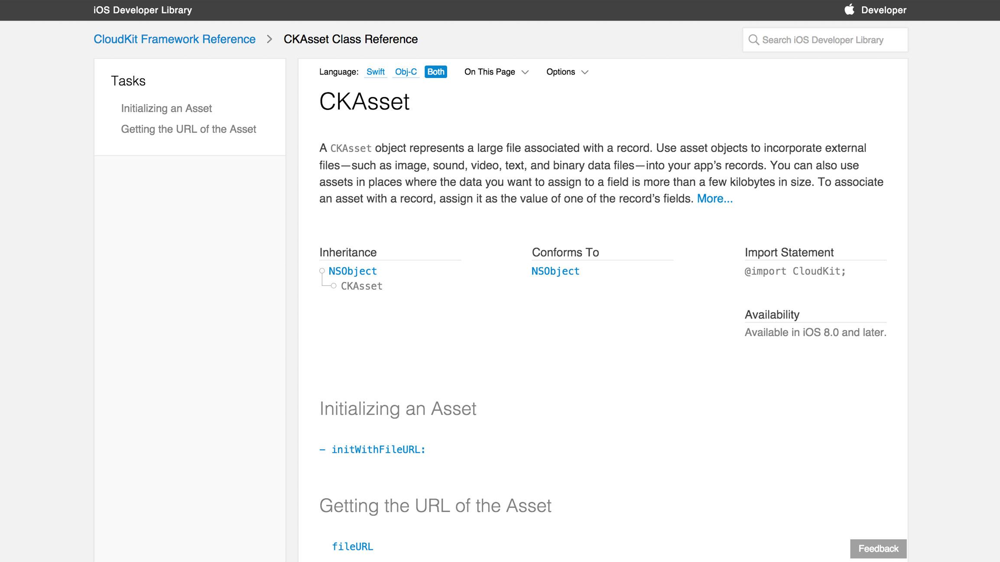

# *How do I even*
# [fit] _**Swift?**_


^Notes
- Thanks for coming!
- Talk is not too technical, lots of other great resources for that
- Give you a sense Swift's design philosophy

---

# Who *am* I?

---

# JP Simard
## *[@simjp](https://twitter.com/simjp)*
## *[realm.io](http://realm.io)*


^Notes
- Work at Realm, a fast database for Objective-C & Swift
- Work on ObjC binding, and Swift almost full time since WWDC

---

```swift
// Using Realm Objects
let company = Company()
company.name = "Realm" // etc...
// Transactions
defaultRealm().transaction {
  realm.add(company)
}
// Querying objects
let companies = objects(Company)
companies[0]?.name // => Realm (generics)
let ftJohns = objects(Employee)
              .filter(.fullTime == true || .name == "John")
```

---

# [fit] 

### [github.com/realm/*realm-cocoa*](https://github.com/realm/realm-cocoa)

^Notes
- Find this on GitHub
- But this talk is not about Realm

---

# _**This talk is not about...**_

* Optionals
* Type safety & inference
* Enums
* Tuples
* Generics
* Closures
* Functional programming

---

# [fit] monads/monoids

---

# [fit] functors/tensors

---

# [fit] SKI combinator calculus

---

# [fit] Flux Capacitors
### *Great Scott!*

---


^Notes
- If you're like me, this stuff makes you lose your sanity a bit
- Functional Programming in Swift book

---

# How do I even...

---

### How do I even...

# [fit] get started?


---

### *How do I even...*

# [fit] *know when to use it?*


---

# When to use Swift

* New apps
* Personal projects
* Scripts
* Bribe your boss to use it in production\*

<sub>\* I am not liable :smiley:</sub>

---

# Swift in production

* Large companies are doing it (twitter & Facebook)
* Contractors are doing it
* I'm doing it
* But be careful if you do it

---

### *How do I even...*

# [fit] *manage dependencies?*


---

## Instead of this

# [fit] 

---

## Think of this

# [fit] 

^Notes
- That being said, CocoaPods team is working hard on Swift support
- Issue #2222, please contribute
- Due dynamic framework support, it'll be awesome

---

### *How do I even...*

# [fit] *interact with Cocoa API's?*



---

> Many API's have been "audited for optional conformance"

^Notes
- First step of many to make things "Swifter"

---

# Porting UIKit code is very straightforward

```swift
func tableView(tableView: UITableView, numberOfRowsInSection section: Int) -> Int {
    return items.count
}

func tableView(tableView: UITableView, 
  cellForRowAtIndexPath indexPath: NSIndexPath) -> UITableViewCell {
    var cell = tableView.dequeueReusableCellWithIdentifier("cell") as UITableViewCell

    cell.textLabel.text = items[indexPath.row]

    return cell
}
```

---

> Though it's possible to replace [square brackets] with (parentheses) and call it Swift, it's by no means where it ends

---

### *How do I even...*

# [fit] *interact with C?*



---

```swift
var aString = "Portland"
withUnsafePointer(&aString) { (arg: UnsafePointer<String>) in
    println("Hello " + arg.memory) // => Hello Portland
}
```

---

### *How do I even...*

# [fit] *interact with C++?*



^Notes
- One word for you

---

# [fit] DON'T

---

> Wrap C++ in Objective-C++ or C to call it from Swift

---

### *How do I even...*

# [fit] *document it?*



---

# jazzy<sup>♪♫</sup>

### [fit]  *[github.com/realm/jazzy](https://github.com/realm/jazzy)*

#### [fit] a soulful way to generate docs for Swift & Objective-C

---


---

### *How do I even...*

# [fit] *do evil things with it?*


^Notes
- By now, you must be asking yourself...
- ObjC allows you to do all sorts of powerful (and sometimes scary) things
- Like...

---

### How do I even...

# [fit] call private functions?

---

# `nm -a libswiftCore.dylib`

```
_swift_stdlib_NSObject_isEqual
_swift_stdlib_NSStringHasPrefixNFD
_swift_stdlib_NSStringHasSuffixNFD
_swift_stdlib_NSStringNFDHashValue
_swift_stdlib_atomicCompareExchangeStrongPtr
_swift_stdlib_compareNSStringDeterministicUnicodeCollation
_swift_stdlib_conformsToProtocol
_swift_stdlib_demangleName
_swift_stdlib_dynamicCastToExistential1
_swift_stdlib_dynamicCastToExistential1Unconditional
_swift_stdlib_getTypeName
```

---

```swift
@asmname("swift_demangleSimpleClass")
func demangleSimpleClass(mangledName: UnsafePointer<Int8>,
    inout moduleName: Int,
    inout className: Int) -> Bool
```

^Notes
- Poke around until you figure out the type signature

---

### *How do I even...*

# [fit] *learn more?*


---

# Links (**)

* *[Official Swift blog](https://developer.apple.com/swift)*
* *[The Swift Programming Language Book](https://developer.apple.com/library/prerelease/ios/documentation/Swift/Conceptual/Swift_Programming_Language/)*
* *[WWDC Videos](https://developer.apple.com/videos/wwdc/2014)*
* *[WWDC Sample Code](https://developer.apple.com/wwdc/resources/sample-code)*
* *[Xcode 6](https://developer.apple.com/downloads)* (and other resources)

<sub>Free Apple Developer Account Required</sub>

---

# Links (*!*)

* This talk: *[github.com/jpsim/talks](https://github.com/jpsim/talks)*
* Other Swift talks: *[realm.io/news](http://realm.io/news)*
* Airspeed Velocity: *[airspeedvelocity.net](http://airspeedvelocity.net)*
* ObjC/Swift doc generator: *[github.com/realm/jazzy](https://github.com/realm/jazzy)*
* Russ Bishop: *[Horrible things in Swift](http://www.russbishop.net/swift-how-did-i-do-horrible-things)*
* Mike Ash's Swift/C Playground from NSSpain: *[Zip Download](http://t.co/PWLYU1joru)*

---

# Links (*!*)

* *[nshipster.com](http://nshipster.com)*
* *[objc.io](http://objc.io)*
* *[Functional Programming in Swift](http://objc.io/books)*

---

# [fit] Thank You!

---

# [fit] `Meetup().questions?.askThem!!`

### JP Simard, *[@simjp](https://twitter.com/simjp)*, *[realm.io](http://realm.io)*
