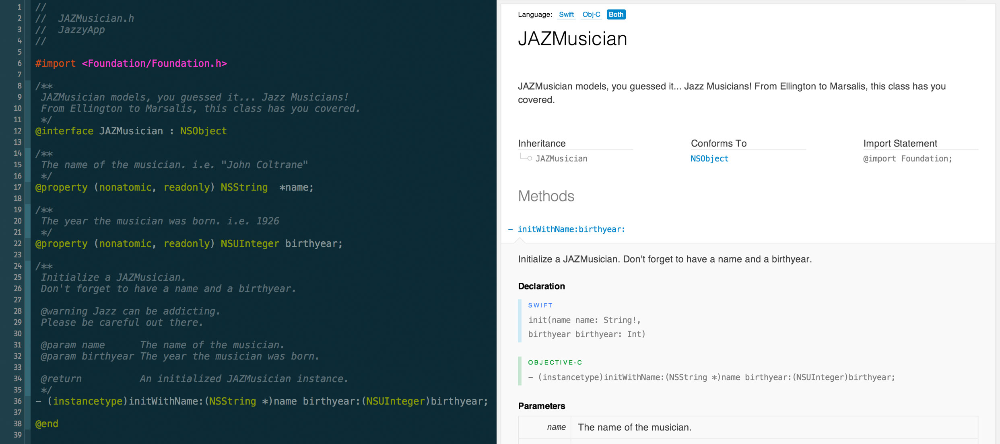
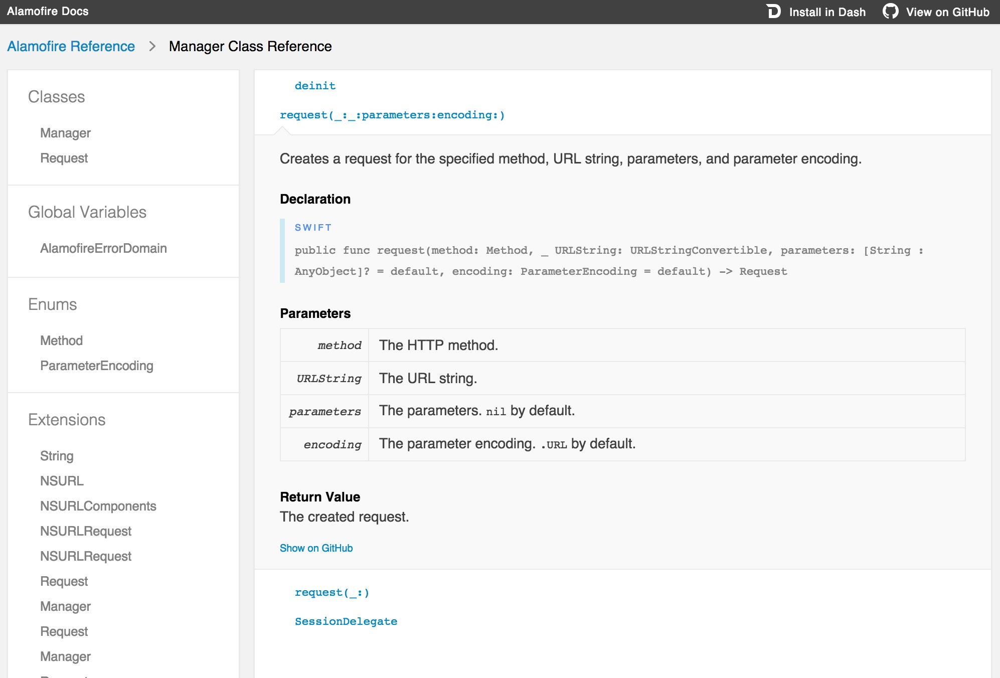
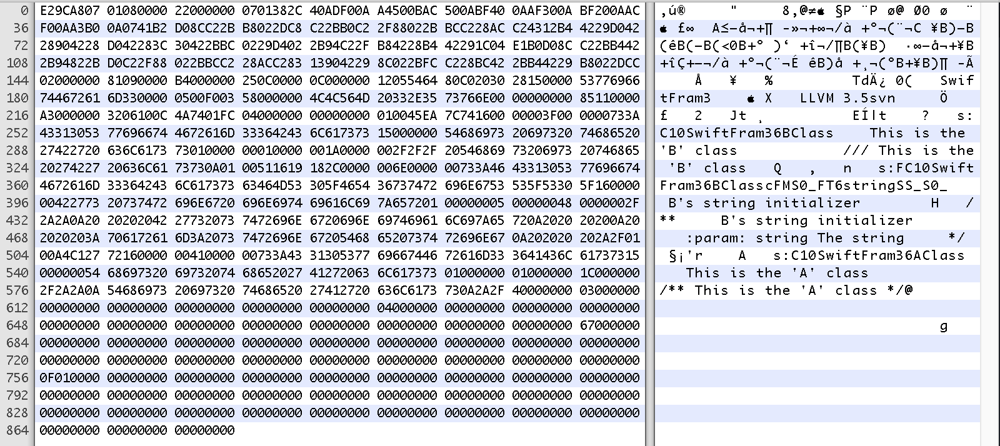
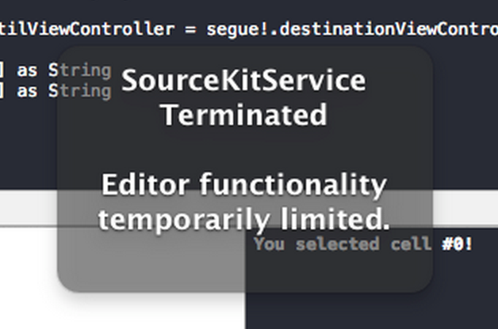

# [fit] jazzy<sup>♪♫</sup>


### [fit] *[github.com/realm/jazzy](https://github.com/realm/jazzy)*

#### [fit] a soulful way to generate docs for Swift & Objective-C

^Notes
- Thanks for the great talk, Jarrett.
- Speaking of Swift missing tools, one of those is a documentation generator.

---


---

# What's a documentation generator?

---

## **Instead of parsing your source files, jazzy hooks into clang/SourceKit and uses the AST representation of your code and its comments for more accurate results.**

^Notes
- Traditionally, these tools are built using regular expressions or hook into the compiler itself.
- We didn't want to do A) and B) isn't possible, so we went a different route.

---



^Notes
- Originally made Swift docs for ObjC interfaces

---



^Notes
- Now makes Swift docs for Swift interfaces

---

# [fit] How do you *USE* it?

---

## **First off, you have to write documentation comments. Which is beneficial not only for jazzy, but for option-clicking in Xcode**

---

# Doxygen (ObjC-style)

```swift
/**
    Lorem ipsum dolor sit amet.

    @param bar Consectetur adipisicing elit.

    @return Sed do eiusmod tempor.
*/
func foo(bar: String) -> AnyObject { ... }
```

---

# Restructured Text (ReST)

```swift
/**
    Lorem ipsum dolor sit amet.

    :param: bar Consectetur adipisicing elit.

    :returns: Sed do eiusmod tempor.
*/
func foo(bar: String) -> AnyObject { ... }
```

^Notes
- VVDocumenter has support for Swift

---

# [fit] `$ [sudo] gem install jazzy`

^Notes
- Installation

---

# [fit] `$ jazzy`

^Notes
- Literally just run that in your app's directory

---

# `$ jazzy`

* Grabs all the `*.swift` files from the specified target and builds docs for them
* Target & destination are configurable...
* Outputs static site in `docs/` by default

---

# Design goals

* Generate source code docs matching Apple's official reference documentation
* Support for Xcode and Dash docsets
* High readability of source code comments
* Leverage modern HTML templating (Mustache)
* Let Clang/SourceKit do all the heavy lifting
* Compatibility with appledoc when possible

---

# `$ jazzy help`

```
-o, --output FOLDER              Folder to output the HTML docs to
-c, --[no-]clean                 Delete contents of output directory before running.
                                 WARNING: If --output is set to ~/Desktop, this will delete the ~/Desktop directory.
-x arg1,arg2,…argN,              Arguments to forward to xcodebuild --xcodebuild-arguments
-a, --author AUTHOR_NAME         Name of author to attribute in docs (i.e. Realm)
-u, --author_url URL             Author URL of this project (i.e. http://realm.io)
-m, --module MODULE_NAME         Name of module being documented. (i.e. RealmSwift)
-d, --dash_url URL               Location of the dash XML feed (i.e. http://realm.io/docsets/realm.xml
-g, --github_url URL             GitHub URL of this project (i.e. https://github.com/realm/realm-cocoa)
--github-file-prefix PREFIX      GitHub URL file prefix of this project (i.e. https://github.com/realm/realm-cocoa/tree/v0.87.1)
-s FILEPATH,                     XML doc file generated from sourcekitten to parse
-r, --root-url URL               Absolute URL root where these docs will be stored
--module-version VERSION         module version. will be used when generating docset
--min-acl [private | internal | public] minimum access control level to document (default is internal)
--[no-]skip-undocumented         Don't document declarations that have no documentation comments.
--podspec FILEPATH
--docset-icon FILEPATH
--docset-path DIRPATH            The relative path for the generated docset
--source-directory DIRPATH       The directory that contains the source to be documented
-v, --version                    Print version number
-h, --help                       Print this help message
```

^Notes
- Lots of options
- Give an overview of min-acl, -x, -github_url

---

# A few feature highlights

^Notes
- Alamofire in Xcode
- online docs
- Cocoadocs (if you make a Swift pod, docs will automatically be generated and hosted on cocoadocs.org)
- Dash

---

# Getting there

---



^Notes
- At first, we wanted to just parse `.swiftoc` files, but that just doesn't contain enough information

---

# SourceKit



^Notes
- SourceKit is the XPC process that does all the code highlighting

---

# SourceKitten

## [github.com/jpsim/SourceKitten](https://github.com/jpsim/SourceKitten)

## **An adorable little framework and command line tool for interacting with SourceKit**

---

# SourceKitten

1. Swift code highlighting
2. Swift interface generation from ObjC headers
3. Generate Swift docs from Swift source
4. General purpose AST manipulation
5. USR generation

---

# SourceKitten

```
$ sourcekitten
Available commands:

   doc         Print Swift docs as JSON or Objective-C docs as XML
   help        Display general or command-specific help
   structure   Print Swift structure information as JSON
   syntax      Print Swift syntax information as JSON
   version     Display the current version of SourceKitten
```

---

# SourceKitten Info

1. Written in Swift
2. Split in two parts: SourceKittenFramework + `sourcekitten`
3. Uses XPC connection to `sourcekitd.framework`, just like Xcode
4. Installable via Homebrew (`brew install sourcekitten`)
5. Similar architecture to Carthage, `Commandant`, package installer

---

# You could do a *lot more* with SourceKitten

1. Swift editor/IDE
2. Swift linter
3. Test generator from doc comments
4. Swift mocks
5. Static analysis
6. Holistic way to diff Swift syntax versions

---

# What's next for jazzy?

1. Objective-C
2. Mixed projects
3. Cross-language (calling ObjC from Swift, calling Swift from ObjC)
4. Cross-project hyperlinking on Cocoadocs

---

# Resources

* jazzy: [github.com/realm/jazzy](https://github.com/realm/jazzy)
* SourceKitten: [github.com/jpsim/SourceKitten](https://github.com/jpsim/SourceKitten)
* appledoc: [github.com/tomaz/appledoc](https://github.com/tomaz/appledoc)
* swift doc syntax: [nshipster.com/swift-documentation](http://nshipster.com/swift-documentation)
* SourceKit: [jpsim.com/uncovering-sourcekit](http://jpsim.com/uncovering-sourcekit)

---

# [fit] `SwiftLDN().questions?.askThem!`

---

# JP Simard, *[@simjp](https://twitter.com/simjp)*, *[realm.io](http://realm.io)*
