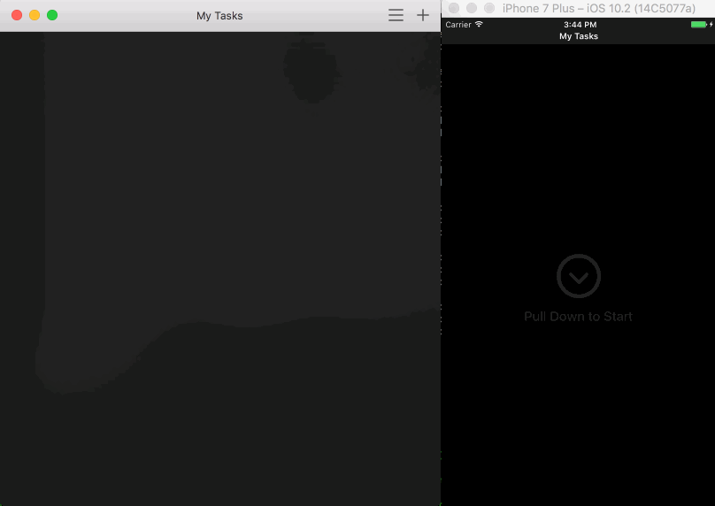
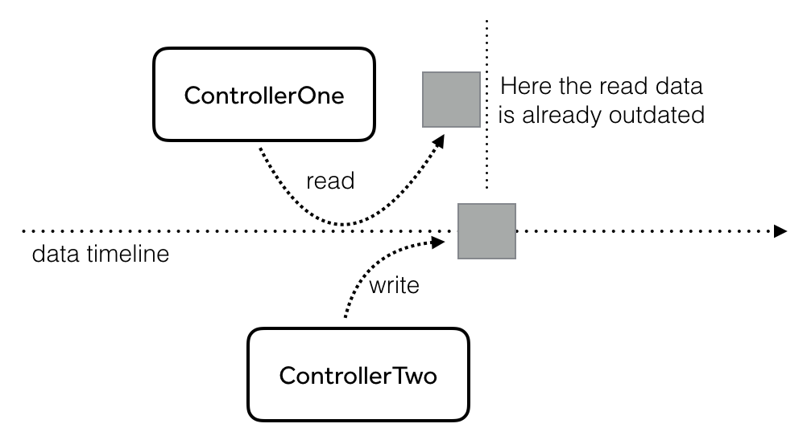

slidenumbers: true

# [fit] Mastering
# [fit] Realm
# [fit] Notifications

### JP Simard, @simjp, realm.io

^
Realm takes a reactive, Objects-as-APIs approach to dealing with data. In this talk, we'll go over tips and tricks for building a variety of user interactions by building off a few primitive Realm notification concepts. We'll cover Interface-Driven Writes, asynchronous vs synchronous query computation, how to architect your app to handle changes that can occur at arbitrary times and how all of this ties into the Realm Mobile Platform.

---



---

# [fit] Cocoa
# [fit] Messaging

^
Let's look at classic messaging approaches in cocoa.

---


^
notification center, callback blocks, setters, injection of classes, KVO, various delegate protocols, and others.

---

# [fit] Reactive
# [fit] Programming

---

# [fit] Reactive
# [fit] != Functional

^
Reactive Programming isn't about scary code

---


^
Or deep stack traces because everything's a signal
https://twitter.com/steipete/status/631491465240145920

---

> _Reactive Programming just means **reacting** to changes & **minimizing** the explicit messaging about changes._

---

# It's about avoiding stale data



---

# It's about avoiding duplicate code paths


---

# Avoid different code paths

* network
* database
* user action
* push notification
* system alerts
* other processes

^
Wouldn't it be better to always just be told when something changed?

---


---


---

# [fit] Intro to
# [fit] Realm
# [fit] Notifications

---

# RealmTasks


---

# Types of Realm Notifications

* Realm Notifications
* Collection Notifications
* KVO
* Upcoming APIs...

---

# [fit] Realm
# [fit] Notifications

---

# Realm Notifications

```swift
let realm = try Realm()
let token = realm.addNotificationBlock { notification, realm in
    viewController.updateUI()
}

// Later...
token.stop()
```

---

# Realm Notifications

* Use when you want to react to _everything_ that happens
* Asynchronously delivered
* `Realm.refresh()` waits for these notifications to be delivered
* There's usually a better way

---

# Notification Token

* How Realm knows how long to deliver notifications for.
* Must hold a strong reference.
* Best to call `stop()` when you no longer want to be notified.
* Logs "released without unregistering a notification" if deallocated without calling `stop()`. Harmless but the best way we know to inform users of incorrect API usage.

^
You may have seen this logged before.

---

# [fit] Collection
# [fit] Notifications

---

# Collection Notifications

```swift
let realm = try Realm()
let results = realm.objects(Item.self) // Auto-Updating Results
let token = results.addNotificationBlock(tableView.applyChanges)
```

---

# Collection Notifications

```swift
extension UITableView {
  func applyChanges<T>(changes: RealmCollectionChange<T>) {
    switch changes {
      case .initial: reloadData()
      case .update(let results, let deletions, let insertions, let updates):
        let fromRow = { (row: Int) in return IndexPath(row: row, section: 0) }

        beginUpdates()
        insertRows(at: insertions.map(fromRow), with: .automatic)
        reloadRows(at: updates.map(fromRow), with: .automatic)
        deleteRows(at: deletions.map(fromRow), with: .automatic)
        endUpdates()
      case .error(let error): fatalError("\(error)")
    }
  }
}
```

---

# [fit] Notifications may be
# [fit] coalesced!
# [fit] \(grouped\)

---

# Notifications may be coalesced (grouped)

```swift
switch changes {
  case .initial: reloadData()
  case .update(let results, let deletions, let insertions, let updates):
    let fromRow = { (row: Int) in return IndexPath(row: row, section: 0) }

    beginUpdates()
    insertRows(at: insertions.map(fromRow), with: .automatic)
    reloadRows(at: updates.map(fromRow), with: .automatic)
    deleteRows(at: deletions.map(fromRow), with: .automatic)
    endUpdates()
  case .error(let error): fatalError("\(error)")
}
```

---

# Synchronous vs Asynchronous Queries

`Results` are queried synchronously if requested, asynchronously otherwise.

---

# Asynchronous Query

```swift
let realm = try Realm()
// Query never performed on the current thread
let results = realm.objects(Item.self)
let token = results.addNotificationBlock { _ in
  /* results available asynchronously here */
}
```

---

# Synchronous Query

```swift
let realm = try Realm()
// Query performed synchronously to return first result
_ = results.first // <- query performed here
let token = results.addNotificationBlock { _ in
  /* results available asynchronously here */
}
```

---

# Collection Notifications

* May be coalesced
* Generally delivered on runloop iterations
* Query upkeep always performed on background thread
* Notifications delivered on the source thread
* Can avoid *all* source thread overhead if used correctly

---

# [fit] Interface-Driven
# [fit] Writes

---

# Interface-Driven Writes

* Changeset notifications are all about applying state diffs.
* State _must_ be up to date for the diff to make sense.
* Some changes should be applied to the UI synchronously.

---

Like reordering rows.


---

# Interface-Driven Writes

```swift
func viewDidLoad() {
  messages = realm.objects(Message.self)
  self.token = messages.addNotificationBlock(tableView.applyChanges)
}

func tableView(_ tableView: UITableView,
               commit editingStyle: UITableViewCellEditingStyle,
               forRowAt indexPath: IndexPath) {
  guard editingStyle == .delete else { return }
  realm.beginWrite()
  messages.removeAtIndex(indexPath.row)
  tableView.deleteRows(at: [indexPath], with: .automatic)
  realm.commitWrite(withoutNotifying: [self.token])
}
```

---


---

# [fit] Key-Value
# [fit] Observation

---

# Key-Value Observation

* Enables Realm to work well with Cocoa APIs
* ReactiveCocoa
* Synchronously delivered
* Single property at a time

---

# [fit] Objects
# [fit] as Messages

---

# Inter-process data sharing/message passing

* Realm already has robust interprocess data sharing
* Could use to share data or notify main iOS app from app extension

---

# Not limited to single-device

* Also for Realm Object Server communication
* And massively distributed apps

^
Tim's talk on objects as events later will show you that this isn't limited to
single-device solutions, but also massively distributed apps.

---

# Objects as Messages

```swift
let managementRealm = try user.managementRealm()
try managementRealm.write {
  let permissionChange = SyncPermissionChange(realmURL: realmURL,
                                              userID: anotherUserID,
                                              mayRead: true,
                                              mayWrite: true,
                                              mayManage: false)
  managementRealm.add(permissionChange)
}
```

---

# Objects as Messages

```swift
let collectionOfOne = managementRealm.objects(SyncPermissionChange.self)
                                     .filter("id = %@", permissionChange.id)
token = collectionOfOne.addNotificationBlock { notification in
  if case .update(let changes, _, _, _) = notification,
    let change = changes.first {
    // Object Server processed the permission change operation
    switch change.status {
    case .notProcessed: break // handle case
    case .success: break // handle case
    case .error: break // handle case
    }
    print(change.statusMessage) // contains error or message
  }
}
```

^
A bit awkward since we just care about a single object but have to use collection notifications

---

# [fit] Object-Level
# [fit] Notifications

---

# Object-Level Notifications

```swift
let realm = try Realm()
let jane = realm.objects(Person.self).filter("name == 'Jane'").first!
let token = jane.addNotificationBlock { change in
  switch change {
  case .change(let propertyChanges):
    for propChange in propertyChanges {
      print("'\(propChange.name)': \(propChange.oldValue) -> \(propChange.newValue)")
    }
  case .deleted: print("object was deleted")
  case .error(let error): print("notification couldn't be delivered: \(error)")
  }
}

// Later...
token.stop()
```

---

# Object-Level Notifications

```swift
let realm = try Realm()
let state = realm.objects(AppState.self).first!
let token1 = state.addNotificationBlock(observingProperties: ["unreadCount", "status"],
                                        block: { change in
  // handle change and restrict to properties we care about
})

let token2 = state.addNotificationBlock(ignoringProperties: ["noisyProp"],
                                        block: { change in
  // handle change and avoid being notified for properties we don't care about
})
```

---

# Object-Level Notifications

* Coming early 2017
* Asynchronously delivered
* Great for Objects-as-APIs/Messages and event handling

---

# Resources

* Realm's docs on Notifications
    * [realm.io/docs/swift#notifications](https://realm.io/docs/swift/latest/#notifications)
* Live Objects and Fine-Grained Notifications
    * [realm.io/news](https://realm.io/news/live-objects-fine-grained-notifications-realm-update/)
* RealmTasks
  * [github.com/realm/RealmTasks](https://github.com/realm/RealmTasks)
  * Removing workaround PR: [RealmTasks#352](https://github.com/realm/RealmTasks/pull/352)
* RxRealm: [RxSwiftCommunity/RxRealm](https://github.com/RxSwiftCommunity/RxRealm)

---

# [fit] Thank You!
# [fit] Questions?

### JP Simard, @simjp, realm.io
