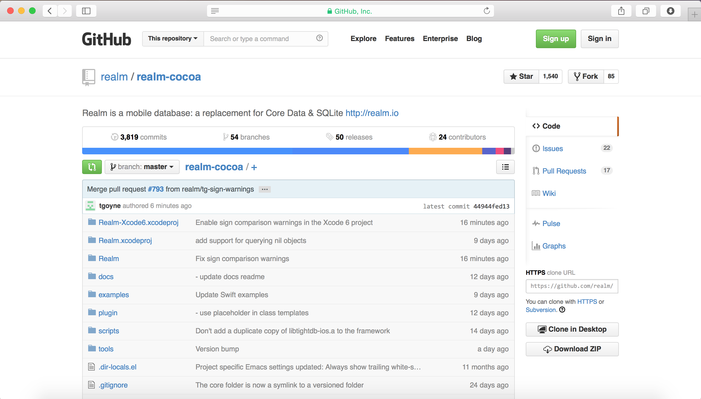
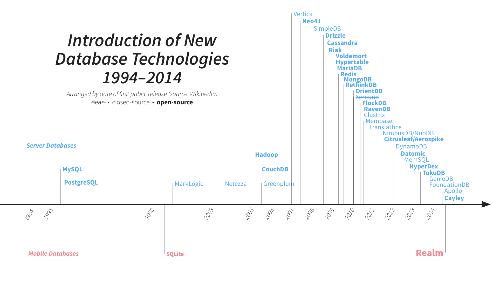
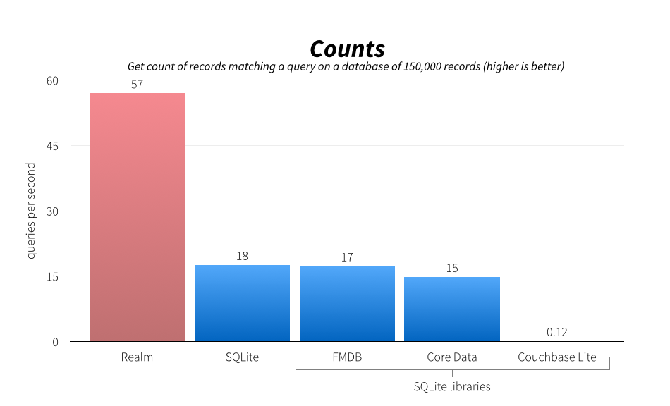
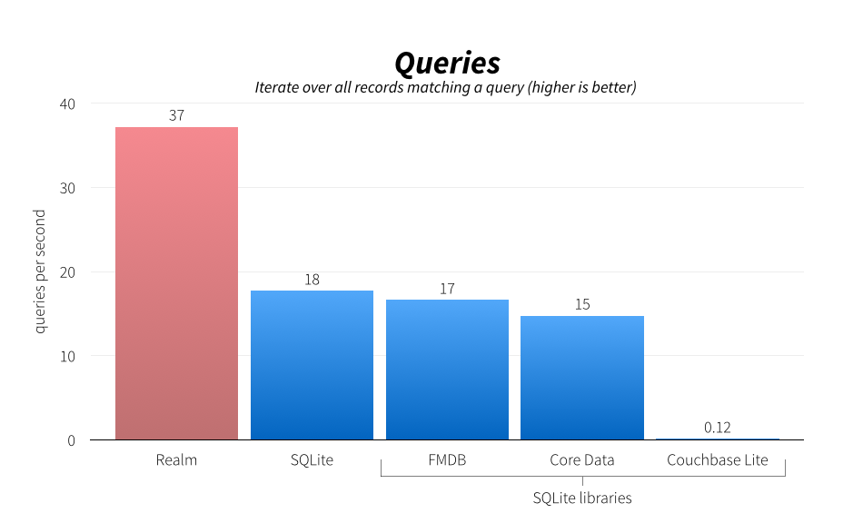
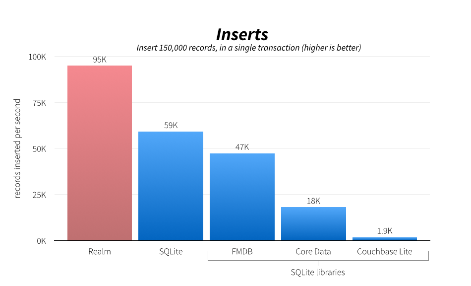

# [fit] Realm



---

# What is Realm?

* **Fast, embedded database** (zero-copy, not an ORM)
* **Used in apps with *millions* of users**
* **NoSQL**
* **Full [ACID](http://en.wikipedia.org/wiki/ACID) transactions**
* **Well defined threading model**
* **Cross-platform C++ core with many language bindings** (only Objective-C & Swift released)

^Notes
- Atomicity, Consistency, Isolation, Durability
- Most NoSQL stores lack true ACID transactions
- Same file format across platforms

---

# Open Source*

# [fit] 

## [github.com/realm/*realm-cocoa*](https://github.com/realm/realm-cocoa)

### **\* Bindings 100% open source, C++ core being released as Apache 2**

---

# Open Source*

\* Cocoa binding 100% open source, C++ core in process of being released under Apache 2.0.

---

# [fit] Why?

^Notes
- Lots of reactions at launch:
- Aren't SQLite & Core Data good enough?

---



---

# Current State of iOS Persistence

---

# Core Data

* Full-featured & mature
* 10+ years old ORM for SQLite
* Slow
* Complex and difficult to learn/debug
*  only

---

# SQLite

* Faster than Core Data
* Optimized for iOS
* Cross Platform
* 14+ years old
* Bad user experience
* Manual mapping and queries
* Lack of thread safety

^Notes
- designed to run on military aircraft carriers

---

# Other Options

- FMDB
- YapDatabase
- CouchbaseLite
- LevelDB

^Notes
- All but LevelDB are wrappers around SQLite

---

# Lots has changed in last decade

* Smartphone Revolution
* NoSQL
* Need for Sync

^Notes
- DB's aren't "one size fits all"
- NoSQL is a better fit for mobile: object-oriented
- Sync causes problems if it's hacked over the database (iCloud)

---

# Benchmarks

---



---



---



---

# Realm Models

```objc
@interface Employee : RLMObject
@property NSString *name;
@property NSDate *startDate;
@property float salary;
@property BOOL fullTime;
@end

RLM_ARRAY_TYPE(Employee)

@interface Company : RLMObject
@property NSString *name;
@property Employee *ceo;
@property RLMArray<Employee> *employees;
@end
```

^Notes
- Like any other Objective-C object

---

# Realm Models (Swift)

```swift
class Employee: Object {
    dynamic var name = ""
    dynamic var startDate = NSDate()
    dynamic var salary = 0.0
    dynamic var fullTime = true
}

class Company: Object {
    dynamic var name = ""
    dynamic var ceo = Employee()
    var employees = List<Employee>()
}
```

---

# Using Realm

```objc
// Using Realm Objects
Company *company = [[Company alloc] init];
company.name = @"Realm"; // etc...

// Transactions
RLMRealm *realm = [RLMRealm defaultRealm];
[realm transactionWithBlock:^{
    [realm addObject:company];
}];

// Querying objects
RLMArray *companies = [Company allObjects];
RLMArray *FTEmployees = [Employee objectsWhere:@"fullTime == YES"];
```

---

# Using Realm (Swift)

```swift
// Using Realm Objects
let company = Company()
company.name = "Realm" // etc...

// Transactions
defaultRealm().write {
  realm.add(company)
}

// Querying objects
let companies = objects(Company)
companies[0]?.name // => Realm (generics)
let ftJohns = objects(Employee).filter(.fullTime == true && .name == "John")
```

---

# Demo


---

# Work In Progress

* Change notifications/Live Results Sets
* Delete Rules
* Bi-directional relationships
* Sync
* Open Source Core
* Android

---

# [fit] Questions?

## @simjp, jp@realm.io
