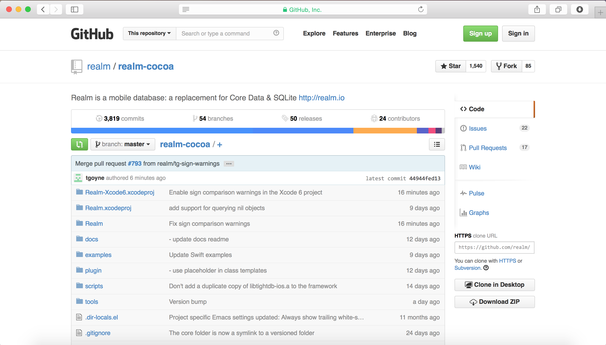
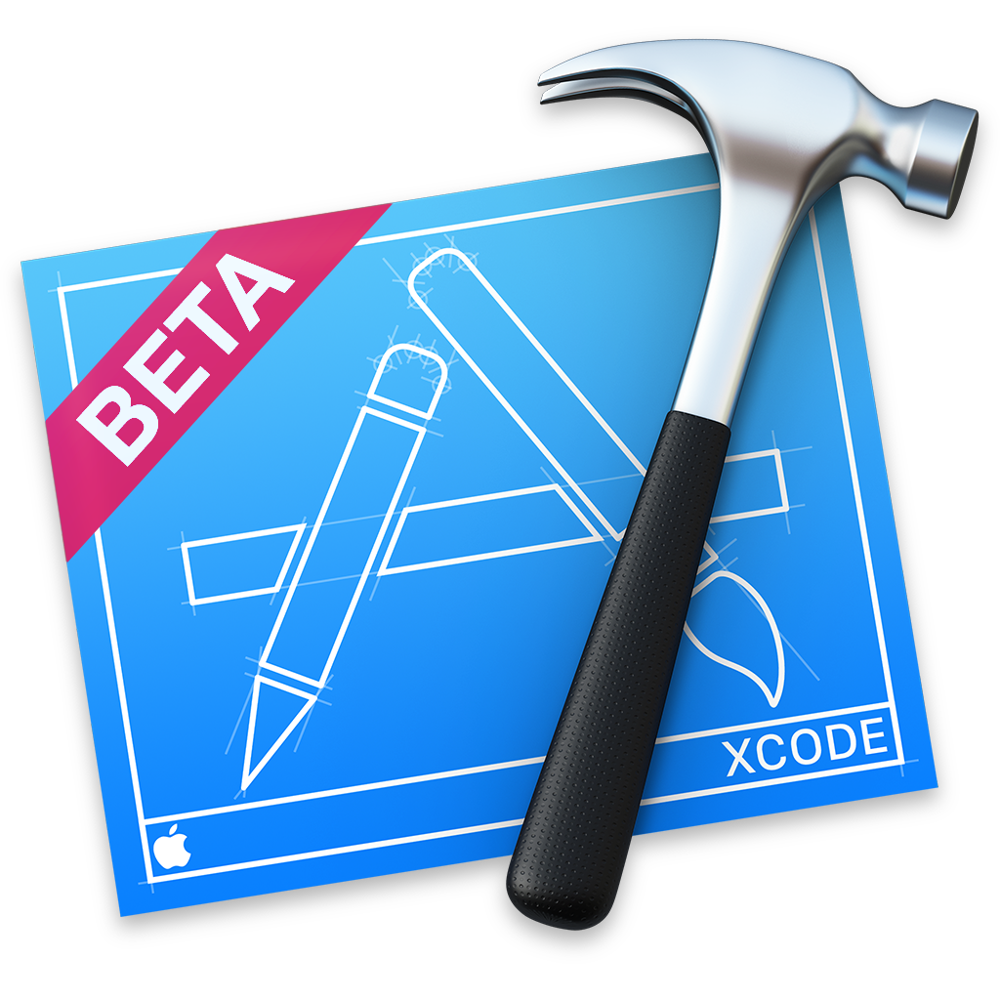

# [fit] Realm

## An insider's perspective



---

# Who am I?

* JP Simard
* Work at Realm
* **[@simjp](https://twitter.com/simjp)**
* **[realm.io](http://realm.io)**
* Recently moved to San Francisco
* BUT...

^Notes
- Full disclosure: I work at Realm

---

# [fit] From Ottawa


---

# This talk

- Overview of Realm
- Share perspective
- Share lessons learnt
- Gather feedback
- Not a pitch

---

# What is Realm?

---

# What is Realm?

* **Embedded database**
* **NoSQL**
* **Full [ACID](http://en.wikipedia.org/wiki/ACID) transactions**
* **C++ core**
* **Many language bindings** (only Objective-C & Swift released)

^Notes
- Atomicity, Consistency, Isolation, Durability
- Most NoSQL stores lack true ACID transactions
- Source: http://en.wikipedia.org/wiki/NoSQL

---

# Open Source

# [fit] 

##  [github.com/realm/*realm-cocoa*](media/https://github.com/realm/realm-cocoa)

---

# What Realm is *not*

---

# What Realm is *not*

* Not an ORM
* Not API-compatible with Core Data
* Not API-stable (constantly improving)

---

# [fit] Why?

^Notes
- Lots of reactions at launch:
- Aren't SQLite & Core Data good enough?

---


---

# Why a new database?

* SQLite is over 14 years old
* SQLite designed to run on military aircraft carriers
* Core Data is 10 years old, but most of its design if from 1994

---

# Lots has changed in last decade

* Smartphone Revolution
* NoSQL
* Need for Sync

---

# Demo



---

# Relationships

```objc
@interface Person : RLMObject
@property NSString      *name;
@property NSData        *picture;
@property RLMArray<Dog> *dogs;
@end

RLMPerson *person = [[RLMPerson alloc] init];
person.name = @"Tim";
[person.dogs addObject:mydog];
```

---

# Swift

```swift
class Person : RLMObject {
    dynamic var name = ""
    dynamic var picture = NSData()
    dynamic var dogs = RLMArray(objectClassName: "Dog")
}

let person = Person()
person.name = "Tim"
person.dogs.addObject(mydog)
```

---

# [fit] Interesting Lesson #1

---

# Swift Introspection

---

```swift
let valueType = mirror.valueType
var t = ""
switch valueType { // Detect basic types (including optional versions)
case is Bool.Type, is Bool?.Type:
    t = "c"
case is NSDate.Type, is NSDate?.Type:
    t = "@\"NSDate\""
case let objectType as RLMObject.Type:
    let mangledClassName = NSStringFromClass(objectType.self)
    let objectClassName = demangleClassName(mangledClassName)
    t = "@\"\(mangledClassName))\""
    // Construct RLMProperty with objectClassName
}

// create objc property
let attr = objc_property_attribute_t(name: "T", value: t)
class_addProperty(aClass, name, [attr], 1)
```

---

# [fit] Interesting Lesson #2

---

```swift
// This compiles and runs in Swift
class 💩💩💩💩 {
    var 🚀 = 2
    func 💩💩💩(😎: Int, 😺: Int) -> Int {
        return 🚀 + 😎 + 😺
    }
}

var 🐔 = 3
var 🐸 = 🐔 + 2
var 💩 = 💩💩💩💩()
💩.💩💩💩(🐔, 😺:🐸) // => 10
```

---

# How does Objective-C generate setter names?

OR

# What is a valid Objective-C or Swift property name?

---

# How Objective-C generates setter names

```objc
// Objective-C setters only capitalize the first letter
// of the property name if it falls between 'a' and 'z'
int asciiCode = [_name characterAtIndex:0];
BOOL shouldUppercase = asciiCode > 'a' && asciiCode < 'z';
NSString *firstChar = [_name substringToIndex:1];
firstChar = shouldUppercase ? firstChar.uppercaseString : firstChar;
// Setter Name:
// @"set%@%@:", firstChar, [_name substringFromIndex:1]
```

---

# Resources

* Realm docs: **[realm.io/docs](http://realm.io/docs)**
* This talk: **[github.com/jpsim/talks](https://github.com/jpsim/talks)**
* Wikipedia NoSQL: **[wikipedia.org/wiki/NoSQL](http://en.wikipedia.org/wiki/NoSQL)**
* Deckset: **[decksetapp.com](http://decksetapp.com)**
* DeckRocket: **[github.com/jpsim/DeckRocket](https://github.com/jpsim/DeckRocket)**

---

# [fit] Thanks!

## @simjp, jp@realm.io
