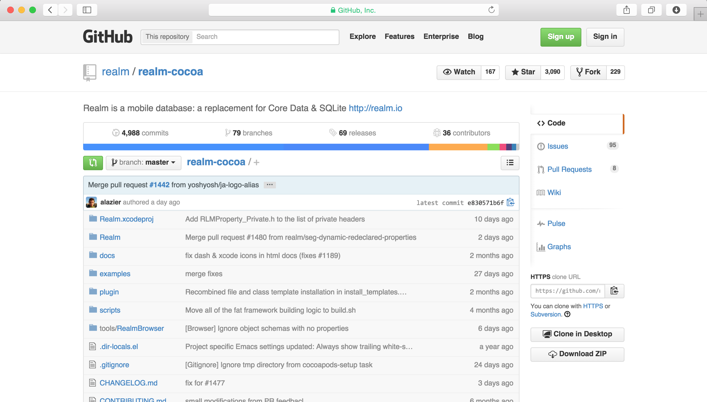
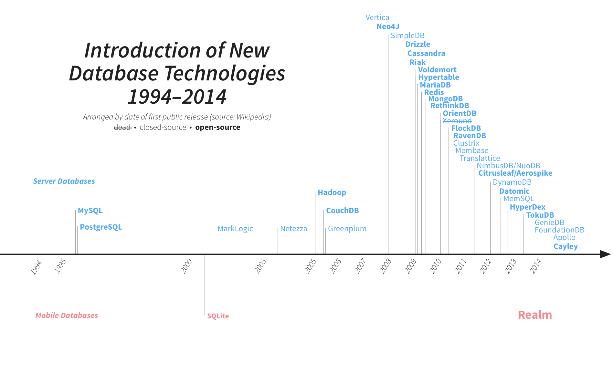
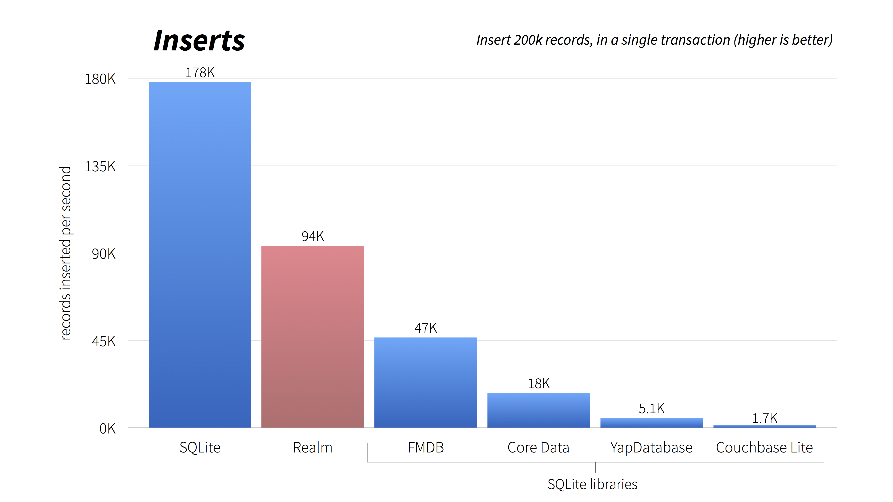
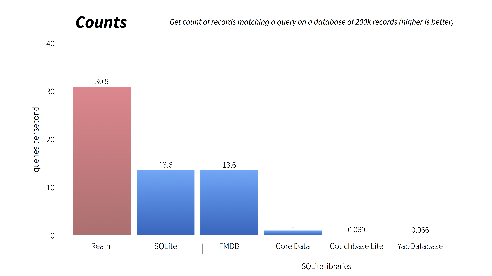
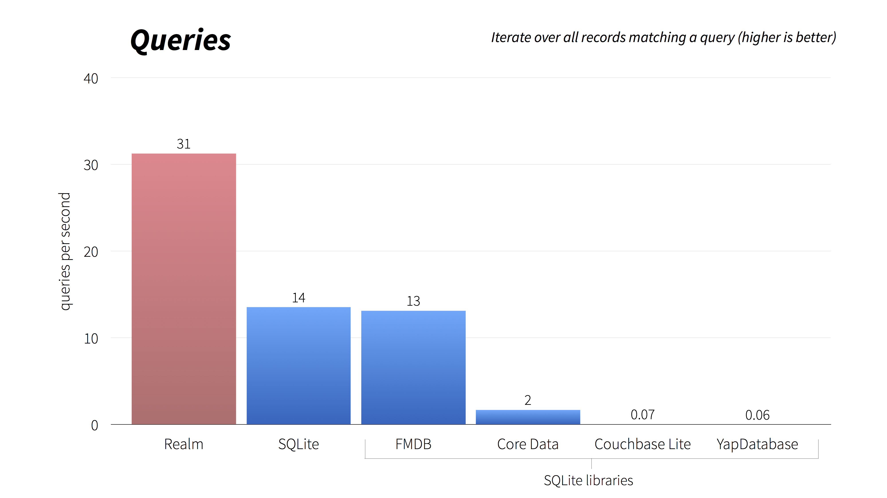
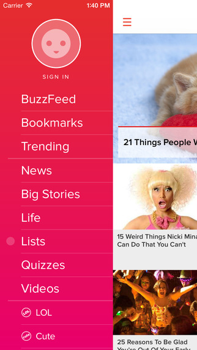
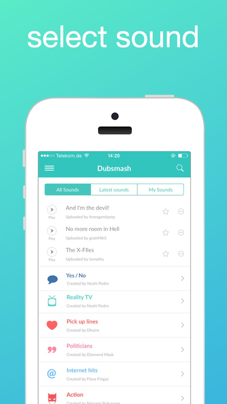
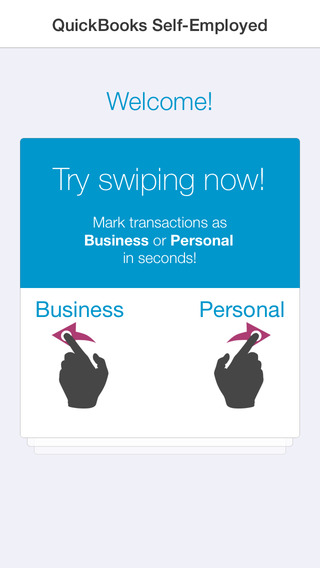
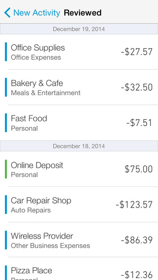
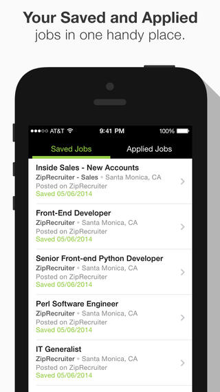

# [fit] Realm



---

# What is Realm?

* **Fast, zero-copy, embedded database**
* **Tens of thousands of devs, 100M+ devices**
* **Object & model-oriented**
* **Full [ACID](http://en.wikipedia.org/wiki/ACID) transactions**
* **Well defined threading model**
* **Cross-platform C++ core with language bindings** (currently Objective-C, Swift & Android)

^Notes
- Not SQLite
- Atomicity, Consistency, Isolation, Durability
- Most NoSQL stores lack true ACID transactions
- Same file format across platforms

---

# Open Source*

# [fit] 

## [github.com/realm/*realm-cocoa*](https://github.com/realm/realm-cocoa)

### \* Bindings 100% open source, C++ core launching as Apache 2

---

# [fit] Why?

^Notes
- Lots of reactions at launch:
- Aren't SQLite & Core Data good enough?

---



---

# Current State of iOS Persistence

---

# Core Data

* Full-featured & mature
* 10+ years old ORM for SQLite
* Slow
* Complex and difficult to learn/debug
*  only

---

# SQLite

* Faster than Core Data
* Optimized for iOS
* Cross Platform
* 14+ years old
* Bad user experience
* Manual mapping and queries
* Lack of thread safety

^Notes
- designed to run on military aircraft carriers

---

# Other Options

- FMDB
- YapDatabase
- CouchbaseLite
- LevelDB

^Notes
- All but LevelDB are wrappers around SQLite

---

# Lots has changed in last decade

* Smartphone Revolution
* Low Connectivity
* NoSQL
* Need for Sync

^Notes
- DB's aren't "one size fits all"
- NoSQL is a better fit for mobile: object-oriented
- Sync causes problems if it's hacked over the database (iCloud)

---

# [fit] Benchmarks

---



---



---



---

# Realm Models

```objc
@interface Employee : RLMObject
@property NSString *name;
@property NSDate *startDate;
@property float salary;
@property BOOL fullTime;
@end

RLM_ARRAY_TYPE(Employee)

@interface Company : RLMObject
@property NSString *name;
@property Employee *ceo;
@property RLMArray<Employee> *employees;
@end
```

^Notes
- Like any other Objective-C object

---

# Realm Models (Swift)

```swift
class Employee: Object {
  dynamic var name = "" // you can specify defaults
  dynamic var startDate = NSDate()
  dynamic var salary = 0.0
  dynamic var fullTime = true
}

class Company: Object {
  dynamic var name = ""
  dynamic var ceo: Employee? // optional. who needs CEO's?!
  let employees = List<Employee>()
}
```

^Notes
- This is all you have to do to define your models
- No code generation, keeping graphical/code in sync
- dynamic backs objects & properties directly by database

---

# Using Realm

```swift
let company = Company() // Using Realm Objects
company.name = "Realm" // etc...

let realm = Realm()
realm.write { // Transactions
  realm.add(company)
}

// Queries
let companies = realm.objects(Company)
companies[0].name // => Realm (generics)
// "Jack"s who work full time (lazily loaded & chainable)
let ftJacks = realm.objects(Employee).filter("name = 'Jack'")
                .filter("fullTime = true")
```

---

# Background Operations

```swift
dispatch_async(queue) {
  let realm = Realm()
  realm.beginWriteTransaction()
  Person.createInDefaultRealmWithObject(
    ["name": "randomstring", "birthdate": NSDate()]
  )
  // make this data available to other threads
  realm.commitWriteTransaction()
}
```

^Notes
- Realm is entirely thread-safe, so anything you can do on the main thread,
you can also do in a background thread and/or NSOperationQueue.

---

# Notifications

```swift
let token = realm.addNotificationBlock { note, realm in
  viewController.updateUI()
}

// Later...
realm.removeNotification(token)
```

> Fine-grain Notifications Coming Soon!

---

# Current Limitations

* **NSDate is truncated to the second**
  (use NSTimeInterval instead)
* **KVO is not supported**
  (we'll add support along with fine-grain notifications)
* **Realm Object Setters & Getters cannot be overriden**
  (use ignored properties as proxies instead)

---

# Work In Progress

* Multiprocess
* Fine-grain notifications
* Async queries
* Cascading deletes
* Nullable types
* Sync
* Open source Core

---

# Where is Realm used?

---

# [fit] Thermodo


^Notes
- The tiny electrical thermometer for your mobile device that lets you measure the temperature, right where you are.

---

# [fit] Groupon


^Notes
- Deals app
- https://itunes.apple.com/us/app/id352683833

---

# [fit] Coinbase


^Notes
- Popular bitcoin wallet
- https://itunes.apple.com/us/app/id886427730

---

# [fit] Buzzfeed




^Notes
- Social news
- https://itunes.apple.com/us/app/id352969997

---

# [fit] Dubsmash




^Notes
- Fun messaging app
- https://itunes.apple.com/us/app/id918820076

---

# [fit] Quickbooks





^Notes
- Business finance tracker
- https://itunes.apple.com/us/app/id898076976

---

# [fit] ZipRecruiter




^Notes
- Job search
- https://itunes.apple.com/us/app/id541933937

---

# [fit] Macaroni


^Notes
- Food sharing app
- https://itunes.apple.com/jp/app/id871722891

---

# [fit] Aplos


^Notes
- Simple Twitter client
- https://itunes.apple.com/jp/app/id910000043

---

# What Can You Build With Realm?

---

# Where to find us

* Facebook: [j.mp/realmjp](http://j.mp/realmjp)
* Twitter: [twitter.com/realm](http://twitter.com/realm)
* GitHub: [github.com/realm](https://github.com/realm)
* StackOverflow: [stackoverflow.com/questions/tagged/realm](https://stackoverflow.com/questions/tagged/realm?sort=newest)
* Email: [help@realm.io](mailto://help@realm.io)

---

# [j.mp/realmjp](http://j.mp/realmjp)
# [fit] Questions?
## @simjp, jp@realm.io
