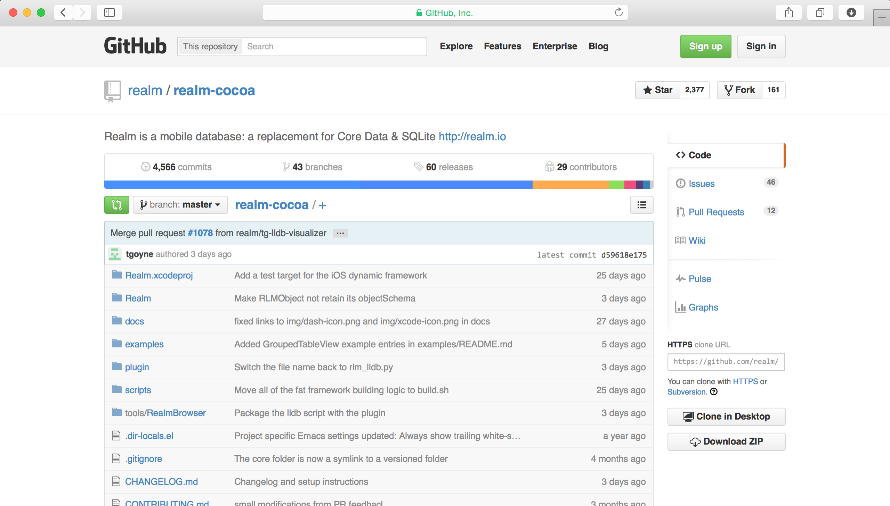
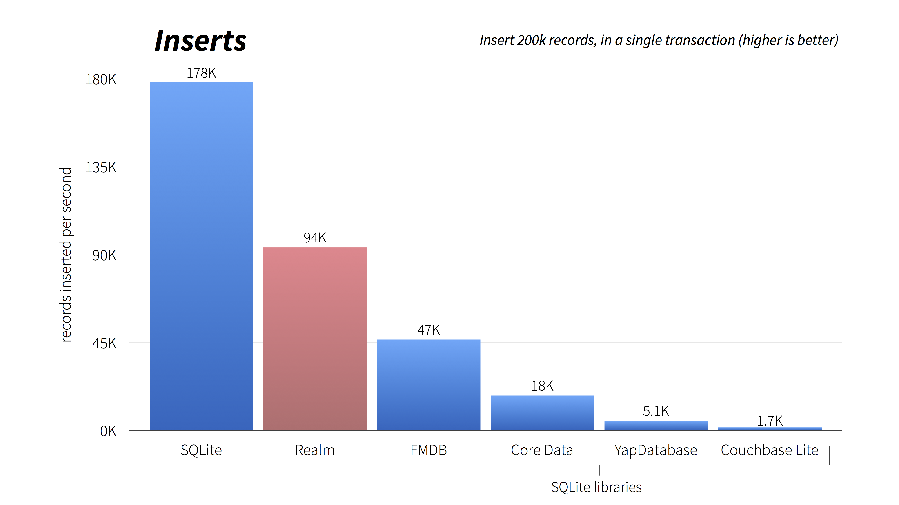
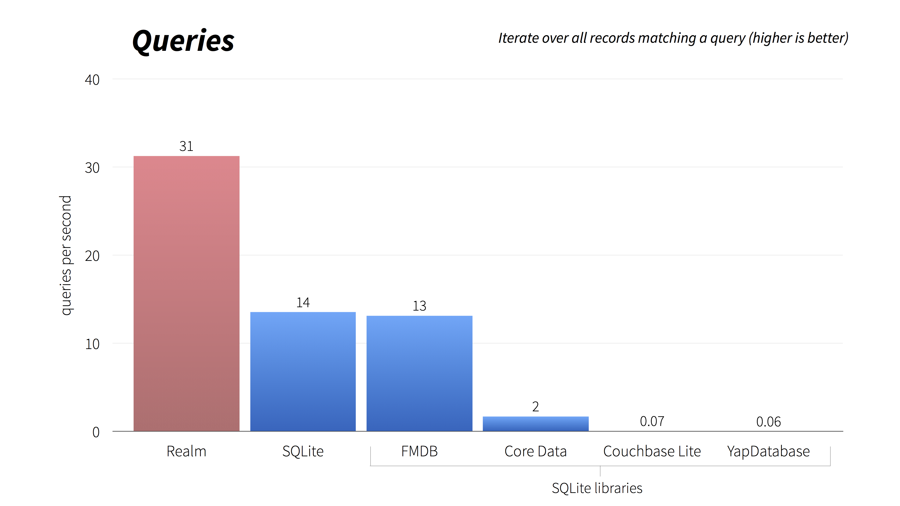

# [fit] Realm



---

# What is Realm?

* **Fast, zero-copy, embedded database**
* **Used in apps with *millions* of users**
* **NoSQL**
* **Full [ACID](http://en.wikipedia.org/wiki/ACID) transactions**
* **Well defined threading model**
* **Cross-platform C++ core with many language bindings** (currently Objective-C, Swift & Android)

^Notes
- Not SQLite
- Used by companies like Groupon, Coursera, Zynga...
- Atomicity, Consistency, Isolation, Durability
- Most NoSQL stores lack true ACID transactions
- Same file format across platforms

---

# Open Source*

# [fit] 

## [github.com/realm/*realm-cocoa*](https://github.com/realm/realm-cocoa)

### \* Bindings 100% open source, C++ core launching as Apache 2

---

# [fit] Why?

^Notes
- Lots of reactions at launch:
- Aren't SQLite & Core Data good enough?

---


---

# Current State of iOS Persistence

---

# Core Data

* Full-featured & mature
* 10+ years old ORM for SQLite
* Slow
* Complex and difficult to learn/debug
*  only

---

# SQLite

* Faster than Core Data
* Optimized for iOS
* Cross Platform
* 14+ years old
* Bad user experience
* Manual mapping and queries
* Lack of thread safety

^Notes
- designed to run on military aircraft carriers

---

# Other Options

- FMDB
- YapDatabase
- CouchbaseLite
- LevelDB

^Notes
- All but LevelDB are wrappers around SQLite

---

# Lots has changed in last decade

* Smartphone Revolution
* Low Connectivity
* NoSQL
* Need for Sync

^Notes
- DB's aren't "one size fits all"
- NoSQL is a better fit for mobile: object-oriented
- Sync causes problems if it's hacked over the database (iCloud)

---

# Benchmarks

---



---


---



---

# Realm Models

```objc
@interface Employee : RLMObject
@property NSString *name;
@property NSDate *startDate;
@property float salary;
@property BOOL fullTime;
@end

RLM_ARRAY_TYPE(Employee)

@interface Company : RLMObject
@property NSString *name;
@property Employee *ceo;
@property RLMArray<Employee> *employees;
@end
```

^Notes
- Like any other Objective-C object

---

# Realm Models (Swift)

```swift
class Employee: Object {
  dynamic var name = "" // you can specify defaults
  dynamic var startDate = NSDate()
  dynamic var salary = 0.0
  dynamic var fullTime = true
}

class Company: Object {
  dynamic var name = ""
  dynamic var ceo: Employee? // optional. who needs CEO's?!
  let employees = List<Employee>()
}
```

^Notes
- This is all you have to do to define your models
- No code generation, keeping graphical/code in sync
- dynamic backs objects & properties directly by database

---

# Using Realm

```objc
// Using Realm Objects
Company *company = [[Company alloc] init];
company.name = @"Realm"; // etc...

// Transactions
RLMRealm *realm = [RLMRealm defaultRealm];
[realm transactionWithBlock:^{
    [realm addObject:company];
}];

// Querying objects
RLMArray *companies = [Company allObjects];
RLMArray *FTEmployees = [Employee objectsWhere:@"fullTime == YES"];
```

---

# Using Realm (Swift)

```swift
let company = Company() // Using Realm Objects
company.name = "Realm" // etc...

defaultRealm().write { // Transactions
  defaultRealm().add(company)
}

// Queries
let companies = objects(Company)
companies[0].name // => Realm (generics)
let ftJacks = objects(Employee) // "Jack"s who work full time
              .filter("fullTime == true && name == Jack")
```

---

# Setting up Core Data

---

```swift
@lazy var managedObjectContext: NSManagedObjectContext = {
  let modelURL = NSBundle.mainBundle().URLForResource("SwiftTestOne", withExtension: "momd")
  let mom = NSManagedObjectModel(contentsOfURL: modelURL)
  ZAssert(mom != nil, "Error initializing mom from: \(modelURL)")

  let psc = NSPersistentStoreCoordinator(managedObjectModel: mom)

  let urls = NSFileManager.defaultManager().URLsForDirectory(.DocumentDirectory, inDomains: .UserDomainMask)
  let storeURL = (urls[urls.endIndex-1]).URLByAppendingPathComponent("SwiftTestOne.sqlite")

  var error: NSError? = nil

  var store = psc.addPersistentStoreWithType(NSSQLiteStoreType, configuration: nil, URL: storeURL, options: nil, error: &error)
  if (store == nil) {
    println("Failed to load store")
  }
  ZAssert(store != nil, "Unresolved error \(error?.localizedDescription), \(error?.userInfo)\nAttempted to create store at \(storeURL)")

  var managedObjectContext = NSManagedObjectContext()
  managedObjectContext.persistentStoreCoordinator = psc

  return managedObjectContext
}()
```

^Notes
- http://www.cimgf.com/2014/06/08/the-core-data-stack-in-swift

---

# Setting up Realm

---

# [fit] `defaultRealm()`

---

# Work In Progress

* Change notifications
* Delete Rules
* Sync
* Support for more data types
* Open Source Core

---

# [fit] Questions?

## @simjp, jp@realm.io
