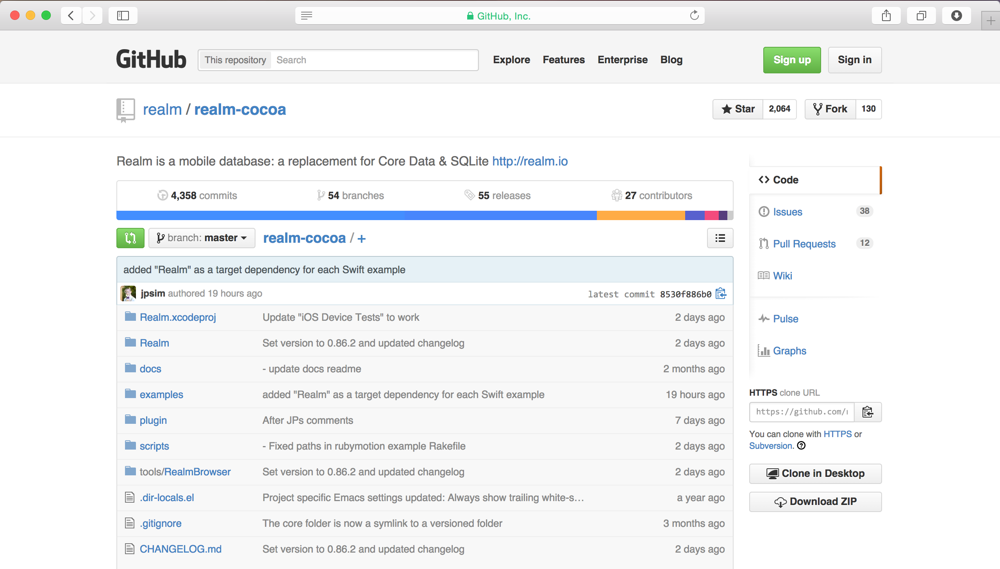

# [fit] **Realm**

## The First **Swift Optimized** Database



^Notes
- I'll explain what I mean by that in a minute
- I almost named this talk...

---

# [fit] Making
# [fit] **compile-time type safety**
# [fit] play nice with
# [fit] **runtime magic**

^Notes
- Based on how Realm for Swift actually works

---

# What is Realm?

* **Fast, zero-copy, embedded database**
* **Used in apps with *millions* of users**
* **NoSQL**
* **Full [ACID](http://en.wikipedia.org/wiki/ACID) transactions**
* **Well defined threading model**
* **Cross-platform C++ core with many language bindings** (currently Objective-C, Swift & Android)

^Notes
- Not SQLite
- Atomicity, Consistency, Isolation, Durability
- Most NoSQL stores lack true ACID transactions
- Same file format across platforms

---

# Open Source*

# [fit] 

## [github.com/realm/*realm-cocoa*](https://github.com/realm/realm-cocoa)

### \* Bindings 100% open source, C++ core will launch as Apache 2

---

# Core Data in Swift

Core Data goes against Swift's strong type safety and generics features.

```swift
let myPersonClass: AnyClass = 
  NSClassFromString("MyGreatApp.Person")
```

---

# Apple had to invent special language constructs in Swift to support Core Data!!

---

> Like the `@dynamic` attribute in Objective-C, the `@NSManaged` attribute informs the Swift compiler that the storage & implementation of a property will be provided at runtime.

^Notes
- https://developer.apple.com/library/prerelease/mac/documentation/Swift/Conceptual/BuildingCocoaApps/WritingSwiftClassesWithObjective-CBehavior.html

---

# Managed context in Core Data

```swift
@lazy var managedObjectContext: NSManagedObjectContext = {
  let modelURL = NSBundle.mainBundle().URLForResource("SwiftTestOne", withExtension: "momd")
  let mom = NSManagedObjectModel(contentsOfURL: modelURL)
  ZAssert(mom != nil, "Error initializing mom from: \(modelURL)")

  let psc = NSPersistentStoreCoordinator(managedObjectModel: mom)

  let urls = NSFileManager.defaultManager().URLsForDirectory(.DocumentDirectory, inDomains: .UserDomainMask)
  let storeURL = (urls[urls.endIndex-1]).URLByAppendingPathComponent("SwiftTestOne.sqlite")

  var error: NSError? = nil

  var store = psc.addPersistentStoreWithType(NSSQLiteStoreType, configuration: nil, URL: storeURL, options: nil, error: &error)
  if (store == nil) {
    println("Failed to load store")
  }
  ZAssert(store != nil, "Unresolved error \(error?.localizedDescription), \(error?.userInfo)\nAttempted to create store at \(storeURL)")

  var managedObjectContext = NSManagedObjectContext()
  managedObjectContext.persistentStoreCoordinator = psc

  return managedObjectContext
}()
```

^Notes
- http://www.cimgf.com/2014/06/08/the-core-data-stack-in-swift

---

# [fit] **TOOLS**

---

# **SwiftData**

## Simple and Effective SQLite Handling in Swift
## [github.com/ryanfowler/SwiftData](https://github.com/ryanfowler/SwiftData)
## Made by Ryan Fowler, [@ryanfowler19](https://twitter.com/ryanfowler19)

```swift
if let err = SD.createTable("Cities", 
             withColumnNamesAndTypes: ["Name": .StringVal, 
                                       "Population": .IntVal]) {
    //there was an error during this function, handle it here
} else {
    //no error, the table was created successfully
}
```

^Notes
- Direct wrapper around SQLite, à la FMDB

---

# **QueryKit**

## Swift CoreData query language
## [querykit.org](http://querykit.org)
## Made by Kyle Fuller, [@kylef](https://twitter.com/kylef)

```swift
Person.queryset(context).filter(Person.name == "Kyle").delete()

// Filtering
queryset.filter(Person.name == "Kyle")
queryset.exclude(Person.age < 21)
queryset.exclude(Person.isEmployed)
```


^Notes
- Great tool for working with Core Data in Swift

---

# Realm in Swift

* **Generics**
* **Type Safety**
* **Default Values**
* **Swift Objects**
* **No Code Generation**
* **Zero Copy**

---

# Realm Models

```swift
class Employee: Object {
  dynamic var name = "" // you can specify defaults
  dynamic var startDate = NSDate()
  dynamic var salary = 0.0
  dynamic var fullTime = true
}

class Company: Object {
  dynamic var name = ""
  dynamic var ceo: Employee? // optional. who needs CEO's?!
  let employees = List<Employee>()
}
```

^Notes
- This is all you have to do to define your models
- No code generation, keeping graphical/code in sync
- dynamic backs objects & properties directly by database

---

# Using Realm

```swift
let company = Company() // Using Realm Objects
company.name = "Realm" // etc...

defaultRealm().write { // Transactions
  defaultRealm().add(company)
}

// Queries
let companies = objects(Company)
companies[0].name // => Realm (generics)
let ftJacks = objects(Employee) // "Jack"s who work full time
              .filter(.fullTime == true && .name == "Jack")
```

^Notes
- I could talk all day about Realm, but I won't
- migrations, change notifications, JSON mapping, primary keys...
- Now let's talk about how this works...

---

# [fit] **Realm**
# [fit] Under the hood

^Notes
- Never before seen look at the Realm internals

---


^Notes
- For those of you keeping track, this is the pizza-riding-space-cowboy part of the talk

---

# [fit] **Thou shalt do**
# [fit] **no**
# [fit] **evil**


^Notes
- For this part, you need to change your mindset

---

# [fit] **Thou shalt do**
# [fit] **~~no~~**
# a convenient amount of
# [fit] **evil**


^Notes
- Evil is a bit of a stretch here, but it's certainly unconventional

---

# [fit] **Evil** things Realm does

# 1. Introspecting Swift from Swift (:thumbsup:)
# 2. Introspecting Swift from ObjC (:scream:)
# 3. Overriding property accessors (:sunglasses:)
# 4. Emoji properties in ObjC (:grimacing:)
# 5. Generic properties in ObjC (:rocket::exclamation:)


---

# [fit] another time...

---

# Resources

* [This talk](https://github.com/jpsim/talks) **(github.com)**
* [Realm on GitHub](https://github.com/realm/realm-cocoa) **(github.com)**
* [Realm's WIP Swift branch](https://github.com/realm/realm-cocoa/tree/jp-swift-syntax-beta7) **(github.com)**
* [Writing Swift Classes With Objective-C Behavior](https://developer.apple.com/library/prerelease/mac/documentation/Swift/Conceptual/BuildingCocoaApps/WritingSwiftClassesWithObjective-CBehavior.html) **(apple.com)**
* [The Core Data Stack in Swift](http://www.cimgf.com/2014/06/08/the-core-data-stack-in-swift) **(cimgf.com)**

---

# [fit] **Thank You!**

---

# [fit] `Meetup().questions?.askThem!`

# JP Simard, *[@simjp](https://twitter.com/simjp)*, *[realm.io](http://realm.io)*
