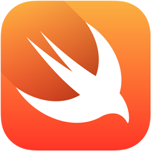
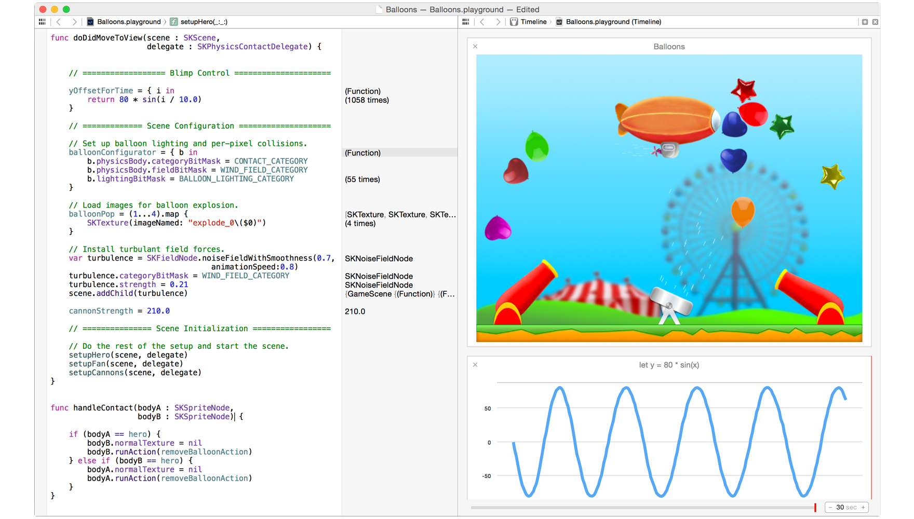

# [fit] Swift

## *for Javascript developers*



^Notes
Thanks for coming!

---

# Who *am* I?

---

# JP Simard
## *[@simjp](https://twitter.com/simjp)*
## *[realm.io](http://realm.io)*


^Notes
- Work at Realm, building a fast database for Objective-C and Swift
- Work on ObjC binding, and now Swift
- Thanks for organizing and supporting this thriving community!

---

###  [github.com/realm/*realm-cocoa*](media/https://github.com/realm/realm-cocoa)

---

# Sponsors

---

* PubNub
* DeNA
* FastForwardJS
* newcircle
* loop/recur
* wework
* SiliconValley CodeCamp

---

# **at *WWDC*...**

---


^Notes
JS devs watched keynote
Thought they knew iOS

---

# Runs in Swift & JS

```swift
var strings = ["a", "b"]
strings.reverse()
strings[0]
```

^Notes
What's the result?

---

# Runs in Swift & JS

```swift
var strings = ["a", "b"] // => [a, b]
strings.reverse() // => [b, a]
strings[0] // => Swift: a, JS: b
```

---

# Similarities

* Syntax
* REPL
* Scripting feel

^Notes
Lots of code compiles in both without modifications
Semicolon is optional in both (:sadface:)
Running `xcrun swift` from CLI is similar to node.js REPL (`node`)

---

# Differences

* Swift is still a *compiled language*
* *API's*, Libraries & Frameworks
* Type safety & generics
* Functional concepts
* Swift will *never* work in-browser

^Notes
Swift will never work in-browser, compilation is expensive and lots of missing pieces
Well, JS kinda has generics: https://developer.mozilla.org/en-US/docs/Web/JavaScript/Reference/Global_Objects/Array#Array_generic_methods

---

# What would it *take* to...

---

# ... run Swift *outside* iOS/OSX

1. Open source Swift *compiler*
2. Open source Swift *runtime*
3. Open source Swift *standard library*

Objective-C is *30 years old* and they still haven't done #3.

^Notes
Swift compiler lives outside clang
Backend (on Linux)
In browser

---

## *Node* REPL
## ==
## *Swift* REPL + Playgrounds

---

`xcrun swift`




---

# Demo


---

*1.* Classes
*2.* Callbacks
*3.* Promises
*4.* Type Safety & Inference
*5.* Tuples
*6.* Mutability
*7.* Functional Programming
*8.* Generics

---

# *1.* Classes

---

# JS "Class"

```js
function Car(model){
  this.model = model;
}

Car.prototype.drive = function() {
  return 'Driving my ' + this.model;
}

var car = new car('Batmobile');
car.drive(); // => Driving my Batmobile
```

^Notes
Notice the air quotes
There's no such thing as a class in JS

---

# Swift Class

```swift
class Car {
    var model = ""
    func drive() -> String {
        return "Driving my " + model
    }
}

let car = Car()
car.model = "Batmobile"
car.drive()
```

^Notes

---

# *2.* Callbacks

---

# JS Callbacks

```js
var log = function(txt, done) {
  setTimeout(function() {
    console.log('callbacks are ' + txt);
    done();
  }, 1000)
}

log('awesome', function() {
  console.log('and done');
});
```

---

# Swift Callbacks

```swift
func log(txt: String, completion: () -> ()) {
    var delta = 1 * Int64(NSEC_PER_SEC)
    var time = dispatch_time(DISPATCH_TIME_NOW, delta)

    dispatch_after(time, dispatch_get_main_queue()) {
        println("closures are " + txt)
    }
}

log("not the same as JS closures") {
    println("and done")
}
```

---

# *3.* Promises

---

# JS Promises

```js
var log = function(txt) {
  return new Promise((resolve) => {
    setTimeout(function() {
      console.log('promises are ' + txt);
      resolve();
    }, 1000)
  })
}

log('the future').then(() => {
  console.log('and done');
});
```

---

# Swift Promises

```swift
func log(txt: String, #resolve: () -> (), #reject: () -> ()) {
    var delta = 1 * Int64(NSEC_PER_SEC)
    var time = dispatch_time(DISPATCH_TIME_NOW, delta)

    dispatch_after(time, dispatch_get_main_queue()) {
        println("closures are " + txt)
        resolve()
    }
}

log("not the same as JS closures",
    resolve: {
        println("and done")
    },
    reject: {
        // handle errors
})
```

---

# *4.* Type *Safety* & *Inference*

---

# Type *Safety* & *Inference*

```swift
let anInt = 3
let aFloat = 0.1416
var pi = anInt + aFloat // Compile warning

pi = 3 + 0.1416
// Compiles: number literals are untyped
```

## Like Rust & Scala

^Notes

---

# *5.* Tuples

---

# Tuples

```swift
let http404Error = (404, "Not Found")
http404Error.0 // => 404
http404Error.1 // => Not Found
```

## Swift :heart: JavaScript

^Notes
- Notice the wonderful type inference at play here

---

# *6.* Mutability

---

# Runs in Swift & JS

```swift
var strings = ["a", "b"] // => [a, b]
strings.reverse() // => [b, a]
strings[0] // => Swift: a, JS: b
```

---

# Mutability in *Swift*

* `var` is mutable
* `let` is immutable

```swift
var letter = "a"
letter = b // works

let a = "a"
a = "b" // compilation error
```

^Notes
Same thing with arrays, dictionaries, etc.

---

# Mutability in *JavaScript*

* `var` is mutable
* `let` is mutable (only limits scope)
* `const` is immutable (only in FireFox & Chrome)

^Notes
https://developer.mozilla.org/en-US/docs/Web/JavaScript/Reference/Statements/let
https://developer.mozilla.org/en-US/docs/Web/JavaScript/Reference/Statements/const

---

# `Object.freeze()` in JavaScript

```js
var obj = {
  foo: "bar"
};

obj.foo = "baz"; // works
Object.freeze(obj); // freezes obj
obj.foo = "bar"; // silently does nothing
```

^Notes
Note that things silently fail, unless "use strict"

---

# *7.* Functional Programming

---

# Functional Programming

```swift
let numbers = [1, 5, 3, 12, 2]
numbers.map {
    (number: Int) -> Int in
    return 3 * number
} // => [3, 15, 9, 36, 6]
numbers.filter {$0 % 2 == 0} // => [12, 2]
```

## Like Underscore.js

^Notes
- There's a lot more than functional concepts in this slide:
- type inference and closures to name a few

---

# *8.* Generics

---

```swift
// Reimplement the Swift standard 
// library's optional type
enum OptionalValue<T> {
    case None
    case Some(T)
}
var maybeInt: OptionalValue<Int> = .None
maybeInt = .Some(100)

// Specialized Array
var letters: [Array]
letters = ["a"]
```

---

# Lots more!

* Optionals
* Super-Enums :tm:
* Structs
* Pattern Matching
* Runtime

---

# [fit] Swift *!=* JS

^Notes
Swift isn't JS:
* API's
* Tooling
* Compiled
* Typesafety

---

# **But!!!**

---

# [fit] Swift *:heart:* JS

^Notes
Swift learned much from JS:
* Readable Syntax

---

# Links (**)

* *[Official Swift website](https://developer.apple.com/swift)* (and blog)
* *[The Swift Programming Language Book](https://developer.apple.com/library/prerelease/ios/documentation/Swift/Conceptual/Swift_Programming_Language/)*
* *[WWDC Videos](https://developer.apple.com/videos/wwdc/2014)*
* *[WWDC Sample Code](https://developer.apple.com/wwdc/resources/sample-code)*
* *[Xcode 6](https://developer.apple.com/wwdc/resources)* (and other resources)

<sub>Free Apple Developer Account Required</sub>

---

# Links (*!*)

* This talk: *[github.com/jpsim/talks](https://github.com/jpsim/talks)*
* MircoZeiss: *[Swift for JavaScript Developers](http://www.mircozeiss.com/swift-for-javascript-developers)* (:thumbsup:x:100:)
* ModusCreate: *[JavaScript Take on Swift](https://moduscreate.com/javascript-take-on-swift)*
* DockYard: *[Swift and JavaScript](http://reefpoints.dockyard.com/2014/06/15/swift-and-javascript.html)*
* Swift on *[StackOverflow](http://stackoverflow.com/questions/tagged/swift)*

---

# Thank You!

---

# [fit] `Meetup().questions?.askThem!`

---

# [fit] `Meetup().questions?.askThem!`

### JP Simard, *[@simjp](https://twitter.com/simjp)*, *[realm.io](http://realm.io)*
