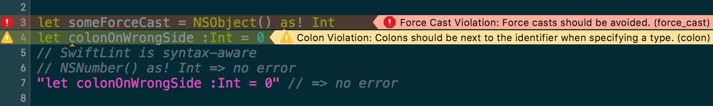

### ​
# [fit] *Performance Profiling*
# ​
# [fit] **Swift on Linux**
# ​
# ​
### JP Simard – @simjp – jp@lyft.com

---

You've ported your Swift code to Linux. 🎉


---

But you find out it's **sloooooooooooww**. 🐢


---

> But I thought Linux was webscale?!


---

> Why _might_ your Swift code be slower on Linux?

---

# [fit] Reasons why Swift code **might** be slower on Linux

* Platform differences
* Low level library differences (mach ports, libpthread, allocator)
* Different implementations
* Darwin Foundation vs `swift-corelibs-foundation`
* Lack of Objective-C runtime & optimizations

---

On macOS, you'd use `Instruments.app` 🤔


---

# No such thing as
# ​
# [fit] `$ apt-get install instruments.app`
# ​
# :disappointed:

---

# **CPU Profilers**

| **Tool**        | **OS**                  | **Notes**                                                        |
|-----------------|-------------------------|------------------------------------------------------------------|
| Instruments.app | macOS                   | Super powerful, accurate, great GUI                              |
| DTrace          | macOS, Solaris, FreeBSD | Powers part of Instruments.app, very scriptable, not on Linux    |
| Callgrind       | macOS, Linux, Solaris   | Fickle, slow, single-threaded, can run in VMs & containers       |
| Perf Events     | Linux on bare metal     | Fast, accurate, CLI only, requires support for hardware counters |

---

# [fit] **VMs** vs **Containers** vs **Bare Metal**

| **VMs/Containers** | **Bare Metal**                 |
|--------------------|--------------------------------|
| Cheap              | Expensive                      |
| Local on macOS     | Dedicated Machine or Dual Boot |
| Convenient         | Not So Much                    |
| Limited Perf Tools | No Limitations                 |

---

# [fit] *Case*
# ​
# [fit] **Study**

---

# **SwiftLint**

### A tool to enforce Swift style and conventions



* Integrates into Xcode
* Plugins for AppCode, Vim, Sublime Text, Atom, Emacs
* 109 rules and counting, covering lint, idiomatic, style, metrics & performance

---


^
It's a command line app, so it lends itself well to being ported to Linux

---

# **SwiftLint Rule**

Recently, a rule was introduced that was particularly slow


---

# [fit] **Demo**

---

# Rule Duration **(Line)**


---

# Rule Duration **(Pie)**


---


---


---


---

```bash, [.highlight: 1]
$ docker run -it --rm swift bash
$ > apt-get update && apt-get install -y valgrind
$ > git clone https://github.com/realm/SwiftLint.git
$ > cd SwiftLint
$ > swift build
$ > valgrind --tool=callgrind .build/debug/swiftlint
$ brew install qcachegrind gprof2dot
$ gprof2dot -f callgrind callgrind.out.*
    | dot -Tsvg -o dotgraph.svg
$ open -a Safari dotgraph.svg
$ open -a qcachegrind
```

---

```bash, [.highlight: 2-6]
$ docker run -it --rm swift bash
$ > apt-get update && apt-get install -y valgrind
$ > git clone https://github.com/realm/SwiftLint.git
$ > cd SwiftLint
$ > swift build
$ > valgrind --tool=callgrind .build/debug/swiftlint
$ brew install qcachegrind gprof2dot
$ gprof2dot -f callgrind callgrind.out.*
    | dot -Tsvg -o dotgraph.svg
$ open -a Safari dotgraph.svg
$ open -a qcachegrind
```

---

```bash, [.highlight: 7-10]
$ docker run -it --rm swift bash
$ > apt-get update && apt-get install -y valgrind
$ > git clone https://github.com/realm/SwiftLint.git
$ > cd SwiftLint
$ > swift build
$ > valgrind --tool=callgrind .build/debug/swiftlint
$ brew install qcachegrind gprof2dot
$ gprof2dot -f callgrind callgrind.out.*
    | dot -Tsvg -o dotgraph.svg
$ open -a Safari dotgraph.svg
$ open -a qcachegrind
```

---


---

```bash, [.highlight: 11]
$ docker run -it --rm swift bash
$ > apt-get update && apt-get install -y valgrind
$ > git clone https://github.com/realm/SwiftLint.git
$ > cd SwiftLint
$ > swift build
$ > valgrind --tool=callgrind .build/debug/swiftlint
$ brew install qcachegrind gprof2dot
$ gprof2dot -f callgrind callgrind.out.*
    | dot -Tsvg -o dotgraph.svg
$ open -a Safari dotgraph.svg
$ open -a qcachegrind
```

---


---

# [fit] **Bare Metal** 🤘


---

```bash, [.highlight: 1-2]
$ doctl compute droplet create perf --size 16gb \
    --image ubuntu-16-10-x64 --region sfo1
$ > apt-get update && apt-get dist-upgrade
$ > reboot
$ > apt-get install -y clang libblocksruntime0 libcurl4-openssl-dev \
      linux-tools-common linux-tools-generic linux-tools-`uname -r`
$ > SWIFT_VERSION=swift-4.0-RELEASE
$ > BASE_URL=https://swift.org/builds/swift-4.0-release/ubuntu1610
$ > URL=$BASE_URL/$SWIFT_VERSION/$SWIFT_VERSION-ubuntu16.10.tar.gz
$ > curl $URL | tar xz --directory $HOME --strip-components=1
$ > export PATH=$HOME/usr/bin:$PATH
$ > export LINUX_SOURCEKIT_LIB_PATH=$HOME/usr/lib
$ > git clone https://github.com/realm/SwiftLint.git
$ > git clone https://github.com/brendangregg/FlameGraph.git
$ > cd SwiftLint
$ > swift build
$ > perf record -g .build/debug/swiftlint
$ > perf script > out.perf
$ > ../FlameGraph/stackcollapse-perf.pl out.perf > out.folded
$ > ../FlameGraph/flamegraph.pl out.folded > flamegraph.svg
```

---

```bash, [.highlight: 3-6]
$ doctl compute droplet create perf --size 16gb \
    --image ubuntu-16-10-x64 --region sfo1
$ > apt-get update && apt-get dist-upgrade
$ > reboot
$ > apt-get install -y clang libblocksruntime0 libcurl4-openssl-dev \
      linux-tools-common linux-tools-generic linux-tools-`uname -r`
$ > SWIFT_VERSION=swift-4.0-RELEASE
$ > BASE_URL=https://swift.org/builds/swift-4.0-release/ubuntu1610
$ > URL=$BASE_URL/$SWIFT_VERSION/$SWIFT_VERSION-ubuntu16.10.tar.gz
$ > curl $URL | tar xz --directory $HOME --strip-components=1
$ > export PATH=$HOME/usr/bin:$PATH
$ > export LINUX_SOURCEKIT_LIB_PATH=$HOME/usr/lib
$ > git clone https://github.com/realm/SwiftLint.git
$ > git clone https://github.com/brendangregg/FlameGraph.git
$ > cd SwiftLint
$ > swift build
$ > perf record -g .build/debug/swiftlint
$ > perf script > out.perf
$ > ../FlameGraph/stackcollapse-perf.pl out.perf > out.folded
$ > ../FlameGraph/flamegraph.pl out.folded > flamegraph.svg
```

---

```bash, [.highlight: 7-12]
$ doctl compute droplet create perf --size 16gb \
    --image ubuntu-16-10-x64 --region sfo1
$ > apt-get update && apt-get dist-upgrade
$ > reboot
$ > apt-get install -y clang libblocksruntime0 libcurl4-openssl-dev \
      linux-tools-common linux-tools-generic linux-tools-`uname -r`
$ > SWIFT_VERSION=swift-4.0-RELEASE
$ > BASE_URL=https://swift.org/builds/swift-4.0-release/ubuntu1610
$ > URL=$BASE_URL/$SWIFT_VERSION/$SWIFT_VERSION-ubuntu16.10.tar.gz
$ > curl $URL | tar xz --directory $HOME --strip-components=1
$ > export PATH=$HOME/usr/bin:$PATH
$ > export LINUX_SOURCEKIT_LIB_PATH=$HOME/usr/lib
$ > git clone https://github.com/realm/SwiftLint.git
$ > git clone https://github.com/brendangregg/FlameGraph.git
$ > cd SwiftLint
$ > swift build
$ > perf record -g .build/debug/swiftlint
$ > perf script > out.perf
$ > ../FlameGraph/stackcollapse-perf.pl out.perf > out.folded
$ > ../FlameGraph/flamegraph.pl out.folded > flamegraph.svg
```

---

```bash, [.highlight: 13-16]
$ doctl compute droplet create perf --size 16gb \
    --image ubuntu-16-10-x64 --region sfo1
$ > apt-get update && apt-get dist-upgrade
$ > reboot
$ > apt-get install -y clang libblocksruntime0 libcurl4-openssl-dev \
      linux-tools-common linux-tools-generic linux-tools-`uname -r`
$ > SWIFT_VERSION=swift-4.0-RELEASE
$ > BASE_URL=https://swift.org/builds/swift-4.0-release/ubuntu1610
$ > URL=$BASE_URL/$SWIFT_VERSION/$SWIFT_VERSION-ubuntu16.10.tar.gz
$ > curl $URL | tar xz --directory $HOME --strip-components=1
$ > export PATH=$HOME/usr/bin:$PATH
$ > export LINUX_SOURCEKIT_LIB_PATH=$HOME/usr/lib
$ > git clone https://github.com/realm/SwiftLint.git
$ > git clone https://github.com/brendangregg/FlameGraph.git
$ > cd SwiftLint
$ > swift build
$ > perf record -g .build/debug/swiftlint
$ > perf script > out.perf
$ > ../FlameGraph/stackcollapse-perf.pl out.perf > out.folded
$ > ../FlameGraph/flamegraph.pl out.folded > flamegraph.svg
```

---

```bash, [.highlight: 17-20]
$ doctl compute droplet create perf --size 16gb \
    --image ubuntu-16-10-x64 --region sfo1
$ > apt-get update && apt-get dist-upgrade
$ > reboot
$ > apt-get install -y clang libblocksruntime0 libcurl4-openssl-dev \
      linux-tools-common linux-tools-generic linux-tools-`uname -r`
$ > SWIFT_VERSION=swift-4.0-RELEASE
$ > BASE_URL=https://swift.org/builds/swift-4.0-release/ubuntu1610
$ > URL=$BASE_URL/$SWIFT_VERSION/$SWIFT_VERSION-ubuntu16.10.tar.gz
$ > curl $URL | tar xz --directory $HOME --strip-components=1
$ > export PATH=$HOME/usr/bin:$PATH
$ > export LINUX_SOURCEKIT_LIB_PATH=$HOME/usr/lib
$ > git clone https://github.com/realm/SwiftLint.git
$ > git clone https://github.com/brendangregg/FlameGraph.git
$ > cd SwiftLint
$ > swift build
$ > perf record -g .build/debug/swiftlint
$ > perf script > out.perf
$ > ../FlameGraph/stackcollapse-perf.pl out.perf > out.folded
$ > ../FlameGraph/flamegraph.pl out.folded > flamegraph.svg
```

---

# [fit] **Demo**

---


---

$ *xcrun swift-demangle* \_T018SwiftLintFramework20LetVarWhitespaceRuleV20attributeLineNumbers33\_013BAF1EF367799B68F2E028EAD9BE9DLLs3SetVySiG012SourceKittenC04FileC4file\_tF

```swift, [.highlight: -1]
//
SwiftLintFramework.
  //
  LetVarWhitespaceRule.
    //
    (attributeLineNumbers in \_013BAF1EF367799B68F2E028EAD9BE9D)
      //
      (file : SourceKittenFramework.File)
        //
        -> Swift.Set<Swift.Int>
```

---

$ *xcrun swift-demangle* \_T018SwiftLintFramework20LetVarWhitespaceRuleV20attributeLineNumbers33\_013BAF1EF367799B68F2E028EAD9BE9DLLs3SetVySiG012SourceKittenC04FileC4file\_tF

```swift
//
SwiftLintFramework.
  //
  LetVarWhitespaceRule.
    //
    (attributeLineNumbers in \_013BAF1EF367799B68F2E028EAD9BE9D)
      //
      (file : SourceKittenFramework.File)
        //
        -> Swift.Set<Swift.Int>
```

---

$ *xcrun swift-demangle* \_T018SwiftLintFramework20LetVarWhitespaceRuleV20attributeLineNumbers33\_013BAF1EF367799B68F2E028EAD9BE9DLLs3SetVySiG012SourceKittenC04FileC4file\_tF

```swift
// Module
SwiftLintFramework.
  // Type (struct)
  LetVarWhitespaceRule.
    // Function
    (attributeLineNumbers in \_013BAF1EF367799B68F2E028EAD9BE9D)
      // Parameter
      (file : SourceKittenFramework.File)
        // Return type
        -> Swift.Set<Swift.Int>
```

---

```swift
public struct LetVarWhitespaceRule: ConfigurationProviderRule, OptInRule {

    /* ... */

    // Collects all the line numbers containing attributes but not declarations
    // other than let/var
    private func attributeLineNumbers(file: File) -> Set<Int> {
        let matches = file.match(pattern: "[@_a-z]+", with: [.attributeBuiltin])
        let matchLines = matches.map { file.line(offset: $0.location) }

        return Set<Int>(matchLines)
    }

    /* ... */

}
```

---

# `$ git diff`

```diff
  // Collects all the line numbers containing attributes but not declarations
  // other than let/var
  private func attributeLineNumbers(file: File) -> Set<Int> {
-     let matches = file.match(pattern: "[@_a-z]+", with: [.attributeBuiltin])
-     let matchLines = matches.map { file.line(offset: $0.location) }
-
-     return Set<Int>(matchLines)
+     return Set(file.syntaxMap.tokens.flatMap({ token in
+         if token.type == SyntaxKind.attributeBuiltin.rawValue {
+             return file.line(byteOffset: token.offset)
+         }
+         return nil
+     }))
  }
```

---


---


---

# **Tools**

* [Perf](http://www.brendangregg.com/perf.html)
* [Valgrind](http://valgrind.org/)
* [Callgrind](http://valgrind.org/docs/manual/cl-manual.html)
* [GNU gprof](https://sourceware.org/binutils/docs/gprof/)
* [KCachegrind](https://kcachegrind.github.io/html/Home.html)
* [FlameGraph](https://github.com/brendangregg/FlameGraph)
* [gprof2dot](https://github.com/jrfonseca/gprof2dot)

---

# Closing **Thoughts**

* Consider writing an *app-specific benchmark mode*
* Prefer measuring with *Instruments.app* if possible
* Prefer measuring on: *bare metal > container > VM*
* Prefer measuring your code: *release > debug*
* Callgrind is *extremely slow*, try to avoid it
* There's a *tooling opportunity* to convert perf/callgrind data to something Instruments compatible

---

# [fit] Thank You!
# [fit] **Questions?**
# ​
### JP Simard – @simjp – jp@lyft.com
