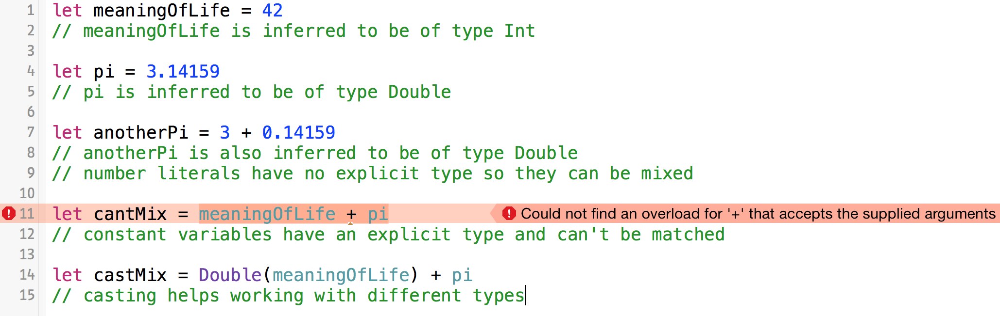
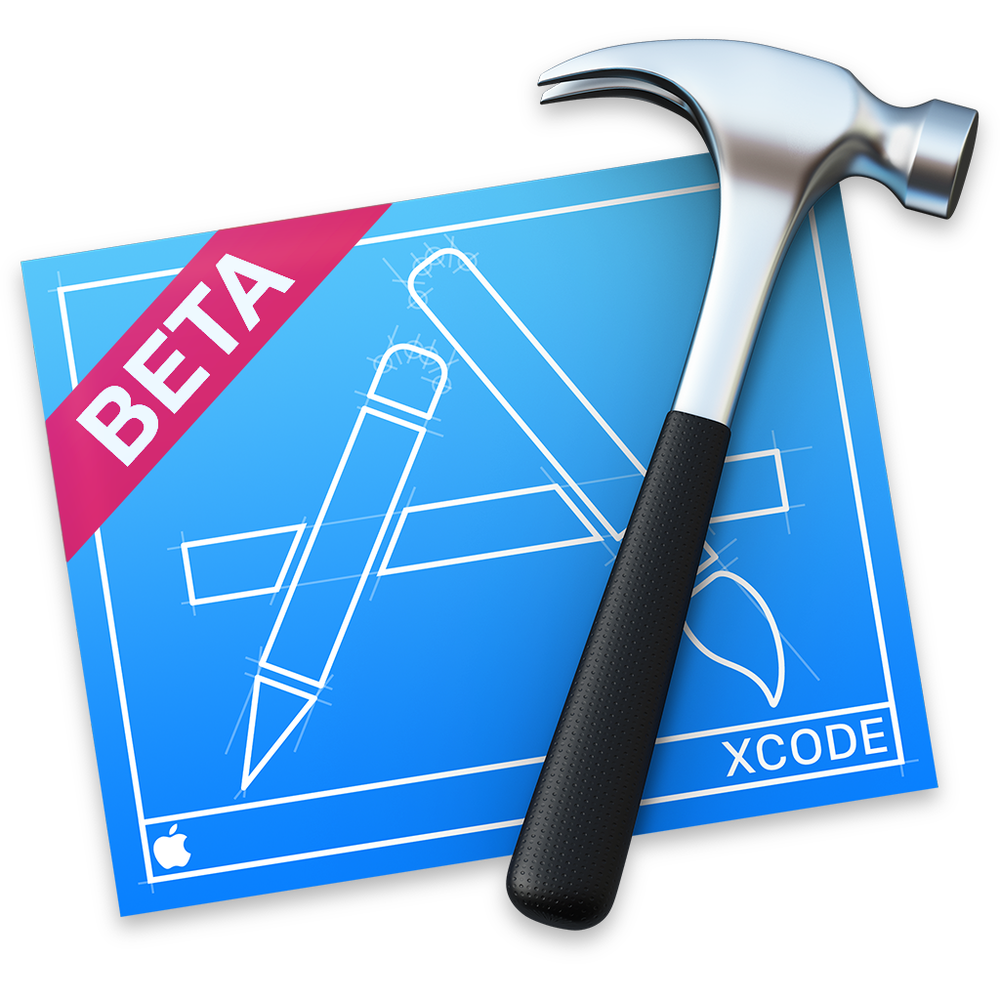

# [fit] Swift

## *Uncharted Territory*

^Notes
- Excited to start conversation with you
- Right now, no one knows a whole lot about Swift
- other than a few ppl at Apple, such as...

---

# Chris Lattner

^Notes
- Only person in the world with 4 years Swift experience
- Couldn't get him to talk today, so...

---

# Chris Lattner

###  LLVM

^Notes
- Only person in the world with 4 years Swift experience
- Couldn't get him to talk today, so...

---

# Chris Lattner

###  LLVM
###  Swift

---

# Chris Lattner

###  LLVM
###  Swift
### :+1: Handsome

---

# Stuck With *Me*

JP Simard
*[@simjp](https://twitter.com/simjp)*
*[realm.io](http://realm.io)*

^Notes
- Work at Realm, building a fast database for iOS
- Work on ObjC binding, and now Swift
- Thanks for organizing and supporting this thriving community!

---

# This Talk

1. Early, incomplete version of a language? 
2. Buggy, pre-release compiler, IDE, OS? 
3. Unreleased beta of presentation app? 
4. Presenter who doesn't fully understand the language? 

---

# [fit] What could *possibly* go wrong?

---

# Why Swift > ObjC?

* Type safety & inference
* Closures
* Tuples
* Super-Enums
* Functional programming
* Generics

^Notes
- Finally, some modern language features!
- Behind the scenes, Swift’s compiler optimizes string usage so that actual copying takes place only when absolutely necessary. This means you always get great performance when working with strings as value types.

---

# Q: What does it *look* like?

^Notes
- Notice the languages that may have inspired this at the bottom

---

# Type *safety* & *inference*

#### Like Rust & Scala

^Notes
- Read through comments

---

# Closures

#### Swift Closures :point_right: ObjC Blocks

^Notes
- capture and store references to variables and constants

---

# Tuples

#### Like Haskell & Scala

^Notes
- Notice the wonderful type inference at play here

---

# Super-Enums\*

#### \*Ok, not exactly the *correct* technical term

---

# Functional programming

#### Like Haskell, Scala & many others

^Notes
- There's a lot more than functional concepts in this slide:
- type inference and closures to name a few

---

# Generics

#### Like... uh... *every* modern language!

---

### Q: What happened to my beloved
# _\*_

---

* *concepts* are still there: reference types and value types
* pointers still exist to interact with C APIs: `UnsafePointer<T>`
* C APIs are still usable:

^Notes
- Sometimes if feels good to ditch C

---

# Demo #1

^Notes
- Build a quick Swift app

---

# Q: How does it all *work*?

---

# **A: it *barely* does :wink:**

---

# Seriously, how does it *work*?

* Swift objects are actually Objective-C objects\*
* \*Without any *methods* or *properties*... strange!
* Just like C++, Swift methods are listed in a *vtable*
* Swift properties are *ivars* with Swift methods
* ivars have no type encoding!!! `ivar_getTypeEncoding(); // always NULL`

^Notes
- Under the hood, Swift object is a valid ObjC object
- Slightly strange ObjC objects

---

# Demo #2

^Notes
- Demo will show how Swift is compiled and works under the hood
- Show reflect(), NSStringFromClass and Hopper dissassembly

---

# Xcode & Tools Integration

* Clang knows absolutely *nothing* about Swift
* Swift compiler talks to clang through *XPC*

`/Applications/Xcode6-Beta.app/Contents/Developer/Toolchains/XcodeDefault.xctoolchain/usr/bin`

^Notes
- All about intermediary Swift compiler
- XPC is technology allowing inter-process communication on OSX

---

# Demo #3

^Notes
- Show some of the internal tools Xcode uses
- Show how jazzy can autogenerate Swift headers from Objective-C source

---

# jazzy♪♫

###  *[github.com/realm/jazzy](media/https://github.com/realm/jazzy)*

#### a soulful way to generate docs for Swift & Objective-C

---

# Links (**)

* *[Official Swift website](https://developer.apple.com/swift)*
* *[The Swift Programming Language Book](https://developer.apple.com/library/prerelease/ios/documentation/Swift/Conceptual/Swift_Programming_Language/)*
* *[WWDC Videos](https://developer.apple.com/videos/wwdc/2014)*
* *[WWDC Sample Code](https://developer.apple.com/wwdc/resources/sample-code)*
* *[Xcode 6](https://developer.apple.com/wwdc/resources)* (and other resources)

Apple Developer Account Required

---

# Links (*!*)

* This talk: *[github.com/jpsim/talks](https://github.com/jpsim/talks)*
* Jay Freeman's AltConf talk: *[debugging your (Swift) apps with cycript](http://www.youtube.com/watch?v=Ii-02vhsdVk)*
* ObjC/Swift doc generator: *[github.com/realm/jazzy](https://github.com/realm/jazzy)*
* Evan Swick: *[Inside Swift](http://www.eswick.com/2014/06/inside-swift)*
* Swift on *[StackOverflow](http://stackoverflow.com/questions/tagged/swift)*

---

# Thank You!

---

# [fit] `Meetup().questions?.askThem!`

#### JP Simard, *[@simjp](https://twitter.com/simjp)*, *[realm.io](http://realm.io)*
