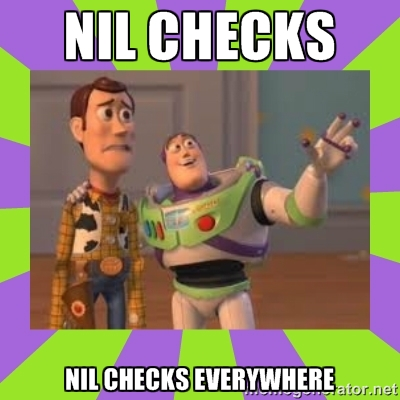

# [fit] Swift

## *for Rubyists*


^Notes
- Thanks for coming!
- Goal not to make you masters
- Goal to give you a sense its design philosophy

---

# Who *am* I?

---

# JP Simard
## *[@simjp](https://twitter.com/simjp)*
## *[realm.io](http://realm.io)*


^Notes
- Work at Realm, building a fast database for Objective-C and Swift
- Work on ObjC binding, and now Swift
- Thanks for organizing and supporting this thriving community!

---

###  [github.com/realm/*realm-cocoa*](https://github.com/realm/realm-cocoa)

---

# [fit]  & *Objective-C*

^Notes
- Before we start, context: Ruby & ObjC

---

# Ruby & Objective-C *Coexist*

* RubyMotion
* CocoaPods
* liftoff
* jazzy
* xcpretty
* lots more

^Notes
- Rich history
- Ruby in iOS apps
- Ruby for tools to build/document iOS apps
- Many objc devs learn ruby to work on these tools and backend

---

# Ruby & Objective-C are *similar*

- common ancestor: smalltalk
- dynamic dispatch
- dynamic typing
- `kind_of?` :point_right: `isKindOfClass:`
- `respond_to?` :point_right: `respondsToSelector:`

---



^Notes
- Most of all, there's A LOT of nil checking

---

# [fit]  & 

^Notes
- but this talk is about Swift
- Most of the ruby/objc similarities were lost when moving to Swift

---

# *Few* similarities between Ruby & Swift

* REPL
* Good for scripting: `#!/usr/bin/xcrun swift`
* Functional concepts in the standard library
* String interpolation

^Notes
- Now pretty easy to use great Cocoa API's in scripts
- i.e. map/filter

---

# Differences

* Swift is still a *compiled language*
* *API's*, Libraries & Frameworks
* Type safety & generics
* Swift doesn't work outside 

^Notes
There are challenges getting Swift to work outside iOS/OSX

---

# What would it *take* to...

---

# ... run Swift *outside* iOS/OSX?

1. Open source Swift *compiler*
2. Open source Swift *runtime*
3. Open source Swift *standard library*

Objective-C is *30 years old* and they still haven't done #3.

^Notes
- Swift compiler lives outside clang
- Server Backend (on Windows/Linux)
- More likely that Apple relaxes virtualization licensing

---

## *Ruby* REPL
## ==
## *Swift* REPL + Playgrounds

---

`xcrun swift`


---

# **Demo**


---

*1.* Classes
*2.* Closures
*3.* Type Safety & Inference
*4.* Mutability
*5.* Functional Programming
*6.* Optionals
*7.* Generics

---

# *1.* Classes

---

# Ruby Class

```ruby
class Vehicle
end

class Car < Vehicle
  def initialize(model)
    @model = model
  end

  def drive
    "driving my " + @model
  end
end

car = Car.new('Batmobile')
car.drive # => Driving my Batmobile
```

^Notes
No explicit base class
Subclassing
Custom initializer
Instance method

---

# Swift Class

```swift
class Vehicle {}
class Car: Vehicle {
    var model = ""
    func drive() -> String {
        return "Driving my " + model
    }
}

let car = Car()
car.model = "Batmobile"
car.drive()
```

^Notes
No explicit base class
Subclassing
Instance method

---

# *2.* Closures

---

# Ruby Closures

```ruby
def say_hello(&block)
  block.call
end

say_hello { puts "Hello there" } # => "Hello there"
```

---

# Swift Closures

```swift
func sayHello(block: () -> ()) {
  block()
}

sayHello { println("Hello there") } // => "Hello there"
```

---

# *3.* Type *Safety* & *Inference*

---

# Ruby's dynamic type

```ruby
name = "John"
name = Time.now()
name = 123.45
```

---

# Swift's Type *Safety* & *Inference*

```swift
let anInt = 3
let aDouble = 0.1416
var pi = anInt + aDouble // Compile warning

pi = 3 + 0.1416
// Compiles: number literals are untyped
```

## Like Rust & Scala

---

# *4.* Mutability

---

# Mutability in *Ruby*

```ruby
str = "abc".freeze
# => "abc"
hash = { str => { str => "value" } }.freeze
# => {"abc"=>{"abc"=>"value"}}
hash[str] = "foo"
# => RuntimeError: can't modify frozen Hash
hash[str][str] = "bar"
# => "bar"
hash
# => {"abc"=>{"abc"=>"bar"}}
```

^Notes
- Everything mutable by default in Ruby
- freeze operates at runtime

---

# Mutability in *Ruby*

```swift
let str = "abc"
// => "abc"
let hash = [str: [str: "value"]]
// => ["abc": ["abc": "value"]]
hash[str] = [str: "foo"]
// => compile error
hash[str]![str] = "bar"
// => compile error
```

^Notes
- let keyword makes objects immutable
- let operates at compile time
- Replacing this example with var works
- 3rd line: Note how we attempt to assign another dictionary instead of a string

---

# Mutability in *Swift*

* `var` is mutable
* `let` is immutable

```swift
var letter = "a"
letter = b // works

let a = "a"
a = "b" // compilation error
```

^Notes
Same thing with arrays, dictionaries, etc.

---

# *5.* Functional Programming

---

# Functional Programming in *Ruby*

```ruby
numbers = [1, 2, 3, 4]
numbers.map { |n|
  3 * n
} # => [3, 6, 9, 12]
numbers.select { |n| n % 2 == 0 } # => [2, 4]
```

---

# Functional Programming in *Swift*

```swift
let numbers = [1, 2, 3, 4]
numbers.map {
  (n: Int) -> Int in
  return 3 * n
} // => [3, 6, 9, 12]
numbers.filter {$0 % 2 == 0} // => [2, 4]
```

^Notes
- Only comparing standard libraries
- There's a lot more than functional concepts in this slide:
- type inference and closures to name a few

---

# *6.* Optionals

---

# Optionals

```swift
var string = ""
if string == nil {} // => compilation error: can never be nil

var optString: String?

if optString == nil {
  optString = "foobar"
}

if let forSureAString = optString {
  println("forSureAString: " + forSureAString)
}
```

^Notes
- Makes code intentions & API's clearer
- Instead of checking for nil everywhere

---

# *7.* Generics

---

```swift
// Re-implement the Swift standard 
// library's optional type
enum OptionalValue<T> {
  case None
  case Some(T)
}
var maybeInt: OptionalValue<Int> = .None
maybeInt = .Some(100)

// Specialized Array
var letters: [String]
letters = ["a"]
```

^Notes
- Due to ruby's dynamic type system, the concept of generics doesn't really exist

---

# Lots more!

* Protocols
* Super-Enums :tm:
* Structs
* Pattern Matching
* Objective-C interoperability
* Runtime

---

# [fit] Swift *!=* Ruby

^Notes
Swift is very different than Ruby:
- API's
- Tooling
- Compiled
- Type safety

---

# Future

* Swift will displace Ruby for Mac-only scripting
* Tools like RubyMotion likely won't be too affected

---

# Links (**)

* *[Official Swift website](https://developer.apple.com/swift)* (and blog)
* *[The Swift Programming Language Book](https://developer.apple.com/library/prerelease/ios/documentation/Swift/Conceptual/Swift_Programming_Language)*
* *[WWDC Videos](https://developer.apple.com/videos/wwdc/2014)*
* *[WWDC Sample Code](https://developer.apple.com/wwdc/resources/sample-code)*
* *[Xcode 6](https://developer.apple.com/wwdc/resources)* (and other resources)

<sub>Free Apple Developer Account Required</sub>

---

# Links (*!*)

* This talk: *[github.com/jpsim/talks](https://github.com/jpsim/talks)*
* From Ruby to Objective-C: *[speakerdeck.com/eddie](https://speakerdeck.com/eddie/from-ruby-to-objective-c)*
* *[Closures in Ruby](http://www.technicalecstasy.net/closures-in-ruby-blocks-procs-and-lambdas)*
* *[Immutability in Ruby](https://deveo.com/blog/2013/03/22/immutability-in-ruby-part-1)*
* *[Why Rubyist Will Love Swift](http://littlelines.com/blog/2014/06/11/why-rubyist-will-love-swift)*

---

# Thank You!

---

# [fit] `Meetup().questions?.askThem!!`

---

# [fit] `Meetup().questions?.askThem!!`

### JP Simard, *[@simjp](https://twitter.com/simjp)*, *[realm.io](http://realm.io)*
