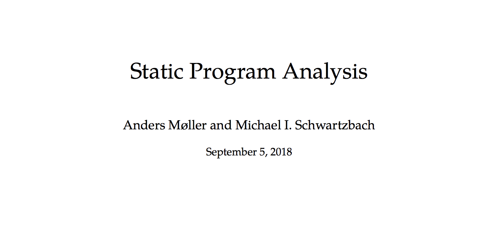
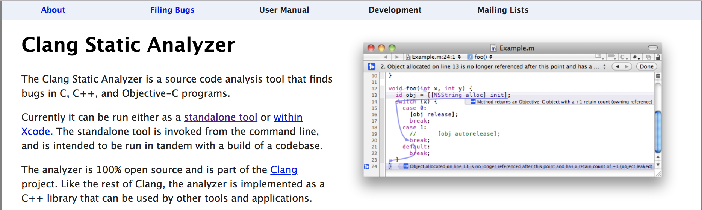
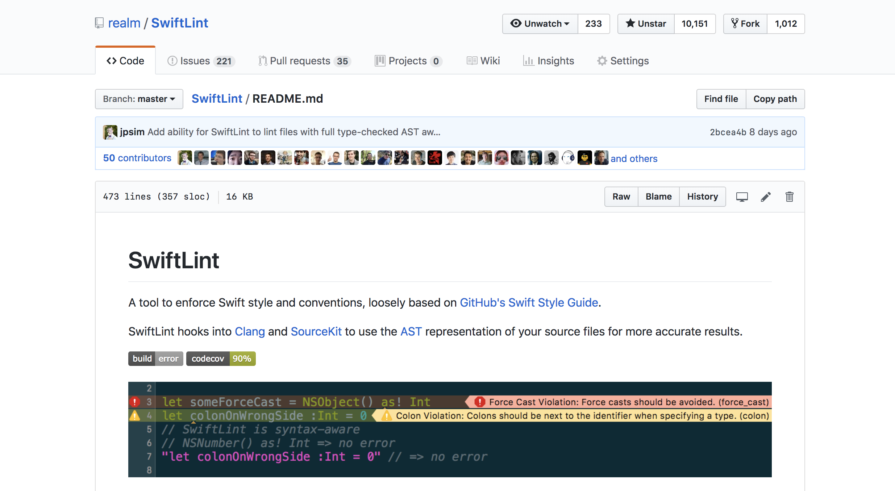
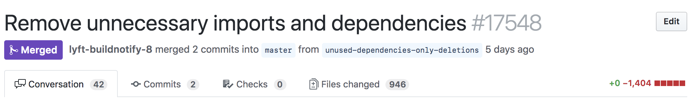

# ​
# ​
# *Bespoke, Artisanal*
#### ​
# [fit] **Swift Static Analysis**
### ​
## ​
# ​
### JP Simard – @simjp – jp@lyft.com


---


^
https://twitter.com/johnregehr/status/1037098838752784384

---



---

# Static analysis

> **Static program analysis** is the art of reasoning about the **behavior** of computer programs **without actually running them**.

## Anders Møller and Michael I. Schwartzbach
## <https://cs.au.dk/~amoeller/spa/spa.pdf>

---

## ​
# [fit] How **hard**
### ​
# [fit] can it be?

---

# How hard can it be?

* Interprocedural Control Flow Graphs
* Lattice Theory
* Monotonicity
* Constant Propagation Analysis
* Very Busy Expressions
* Transfer Functions
* Closure Analysis for the λ-calculus
* 😳, 🤔, 🙃, 🚶‍♂️🚶‍♂️🚶‍♂️🚶‍♂️🚶‍♂️

---


---


---


---



> As its name implies, the **Clang Static Analyzer** is built on top of **Clang** and **LLVM**.

<https://clang-analyzer.llvm.org>

---

# What would a Swift static analyzer look like?

* Similar to how the Clang Static Analyzer is built on Clang & LLVM
* Built alongside the Swift compiler & LLVM
* Require deep knowledge of the compiler internal architecture
* Written in C++
* Require advanced static analysis concepts like CFG's

---


^
What if there was another way?

---

# Can we build Swift static analysis that is:

1. **Simple** to extend?
2. **Fast** to build?
3. **Easy** to run?
4. Doesn't require deep knowledge of C++ or the Swift compiler internals?

---

# ​
# ​
# *Bespoke, Artisanal*
#### ​
# [fit] **Swift Static Analysis**


---

# What are the ingredients?

1. A way to **run over source files**
2. A way to **perform an action** on the source
3. A way to **get detailed information** about the source
4. A way to **extract interesting results** from that information
5. A way to **report these results** to the user
6. A way to **act on these results** whenever possible


---



---

# SwiftLint Already Provides

1. _A way to **run over source files**_
2. _A way to **perform an action** on the source_
3. A way to **get detailed information** about the source
4. A way to **extract interesting results** from that information
5. _A way to **report these results** to the user_
6. _A way to **act on these results** whenever possible_

---

# [fit] All that's left is to find out how to
# ​
# **get detailed information**
#### ​
# and
#### ​
# **extract interesting results**

---

# ​
### ​
# [fit] **Easy!**

---

# SourceKit

<https://github.com/apple/swift/tree/master/tools/SourceKit>

Interesting requests:

* Editor Open
* Index*
* Cursor Info*

\* Requires compiler arguments

---

# Editor open

```swift
// main.swift
struct A {
  func b() {}
}
```

---

```json, [.highlight: 4, 13, 23, 26]
{
  "key.substructure" : [
    {
      "key.kind" : "source.lang.swift.decl.struct",
      "key.offset" : 0,
      "key.nameoffset" : 7,
      "key.namelength" : 1,
      "key.bodyoffset" : 10,
      "key.bodylength" : 13,
      "key.length" : 24,
      "key.substructure" : [
        {
          "key.kind" : "source.lang.swift.decl.function.method.instance",
          "key.offset" : 11,
          "key.nameoffset" : 16,
          "key.namelength" : 3,
          "key.bodyoffset" : 21,
          "key.bodylength" : 0,
          "key.length" : 11,
          "key.substructure" : [

          ],
          "key.name" : "b()"
        }
      ],
      "key.name" : "A"
    }
  ],
  "key.offset" : 0,
  "key.diagnostic_stage" : "source.diagnostic.stage.swift.parse",
  "key.length" : 24
}
```

---

# Index

```swift
// main.swift
struct A {
  func b() {}
}
```

---

```json, [.highlight: 7, 9, 10, 13, 15, 16]
[
  {
    "key.column" : 8,
    "key.entities" : [
      {
        "key.column" : 10,
        "key.kind" : "source.lang.swift.decl.function.method.instance",
        "key.line" : 2,
        "key.name" : "b()",
        "key.usr" : "s:4main1AV1byyF"
      }
    ],
    "key.kind" : "source.lang.swift.decl.struct",
    "key.line" : 1,
    "key.name" : "A",
    "key.usr" : "s:4main1AV"
  }
]
```

---

# Cursor Info

```swift
// main.swift
struct A {
  func b() {}
}
```

---

```json
{
  "key.accessibility" : "source.lang.swift.accessibility.internal",
  "key.annotated_decl" : "<Declaration>func b()<\/Declaration>",
  "key.filepath" : "\/path\/to\/main.swift",
  "key.fully_annotated_decl" : "<...see below...>",
  "key.kind" : "source.lang.swift.decl.function.method.instance",
  "key.length" : 3,
  "key.name" : "b()",
  "key.offset" : 32,
  "key.typename" : "(A) -> () -> ()",
  "key.typeusr" : "_T0yycD",
  "key.usr" : "s:4main1AV1byyF"
}
```

```xml
<decl.function.method.instance>
  <syntaxtype.keyword>func</syntaxtype.keyword> <decl.name>b</decl.name>()
</decl.function.method.instance>
```

---

# How can we **derive interesting results** from this information?

---

# Finding Dead Code ☠️

```swift
struct Fika {
  func eat() {}
}

struct Bagel {
  func eat() {} // <- never used
}

let fika = Fika()
fika.eat()
print(Bagel())
```

---

# Finding Dead Code ☠️☠️

```swift
let allCursorInfo = file.allCursorInfo(compilerArguments: compilerArguments)
let declaredUSRs = findDeclaredUSRs(allCursorInfo: allCursorInfo)
// s:4main4FikaV, s:4main4FikaV3eatyyF, s:4main5BagelV, s:4main5BagelV3eatyyF,
// s:4main4fikaAA4FikaVvp
let referencedUSRs = findReferencedUSRs(allCursorInfo: allCursorInfo)
// s:4main4FikaV, s:4main4fikaAA4FikaVvp, s:4main4FikaV3eatyyF,
// s:s5printyypd_SS9separatorSS10terminatortF, s:4main5BagelV
let unusedDeclarations = declaredUSRs.filter {
    !referencedUSRs.contains($0.usr)
}
// s:4main5BagelV3eatyyF
```

---

# Watch out!

Not all code that isn't _directly accessed_ is _unused_!

```swift
enum WeekDay: String {
    // All these are used but not directly accessed
    case monday, tuesday, wednesday, thursday, friday
}

extension String {
    var isWeekday: Bool {
        return WeekDay(rawValue: self) != nil
    }
}
```

---

# Dead code traps

Turns out, there's a lot of valid Swift code that's never directly accessed.

1. Enum cases
2. Dynamic code: `@IBOutlet`, `@IBAction`, `@objc`
3. Protocol conformance code

---

# Unused Imports ⬇️

```swift
import Dispatch // <- never used
struct A {
    static func dispatchMain() {}
}
A.dispatchMain()

// Would use `Dispatch` module:
//
// dispatchMain()
// or
// Dispatch.dispatchMain()
```

---

# Unused Imports ⬇️⬇️

1. Find all _imported_ modules

```swift
import Dispatch
//     ^ cursor info request
```

```json
{
  "key.is_system" : true,
  "key.kind" : "source.lang.swift.ref.module",
  "key.modulename" : "Dispatch",
  "key.name" : "Dispatch"
}
```

---

# Unused Imports ⬇️⬇️

​2. ​Find all _referenced_ modules

```swift
dispatchMain()
//^ cursor info request
```

```json, [.highlight: 9]
{
  "key.annotated_decl" : "<Declaration>func dispatchMain()...<\/Declaration>",
  "key.doc.full_as_xml" : "<Function>...<\/Function>",
  "key.filepath" : "...\/usr\/include\/Dispatch\/queue.h",
  "key.fully_annotated_decl" : "<decl.function.free>...<\/decl.function.free>",
  "key.is_system" : true,
  "key.kind" : "source.lang.swift.ref.function.free",
  "key.length" : 13,
  "key.modulename" : "Dispatch",
  "key.name" : "dispatchMain()",
  "key.offset" : 35595,
  "key.typename" : "() -> Never",
  "key.typeusr" : "_T0s5NeverOycD",
  "key.usr" : "c:@F@dispatch_main"
}
```

---

# Unused Import Traps

* Doesn't yet support operators
* Doesn't yet support transitive dependencies

---

# ​
### ​
# [fit] **Demo**

---

**Configure**

```yaml
# .swiftlint.yml
included:
  - Source
analyzer_rules:
  - explicit_self
  - unused_import
  - unused_private_declaration
```

**Run**

```shell
$ swiftlint analyze
    --autocorrect
    --compiler-log-path xcodebuild.log
```

---



* Lyft's driver & passenger apps are built from over 4,000 Swift files
* 1,358 imports removed
* 70 direct dependencies removed

^
Not only did this remove 1,358 unused imports, we could subsequently remove 70 direct dependencies from our depedency graph

---


---

# Rule Ideas

* Inefficient code patterns
  (e.g. `filter(...).first` instead of `first(where:)`)
* Conversion of iteration to functional code
* Enforcing code architecture or style policies
* Avoiding or encouraging certain function calls or types
* Linting: explicit/implicit `self`, superfluous type annotations, etc.

---

# Final Thoughts

* 🧙‍♂️ You don't need to be a **compiler wizard** to build Swift tools.

---

# Final Thoughts

* 🧙‍♂️ You don't need to be a **compiler wizard** to build Swift tools.
* Tools are **just apps**.

---

# Final Thoughts

* 🧙‍♂️ You don't need to be a **compiler wizard** to build Swift tools.
* Tools are **just apps**.
* Xcode may be closed source, but **most of the building blocks** you need for custom Swift tooling is **open source**.

---

# Final Thoughts

* 🧙‍♂️ You don't need to be a **compiler wizard** to build Swift tools.
* Tools are **just apps**.
* Xcode may be closed source, but **most of the building blocks** you need for custom Swift tooling is **open source**.
* Other language communities **build all their own tools**. The Swift community should do the same! ✊

---

# ​
# ​
# [fit] **Thank You!**
# ​
### JP Simard – @simjp – jp@lyft.com
