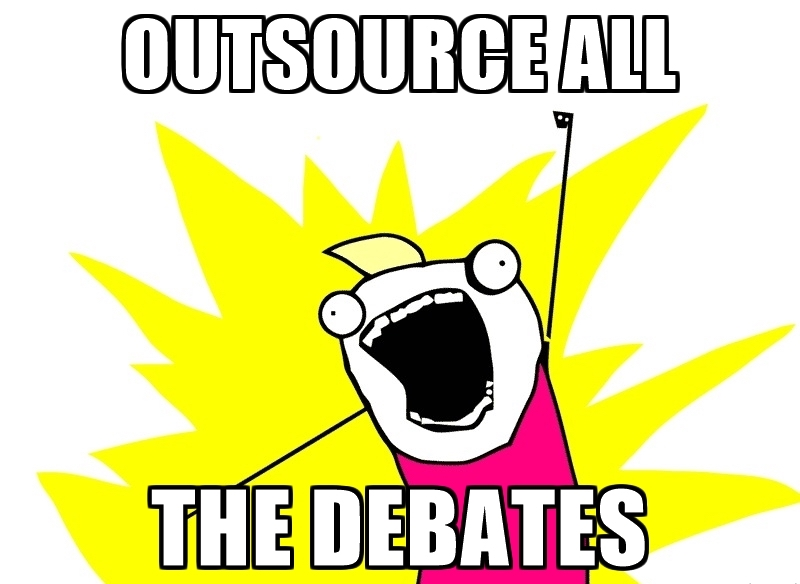
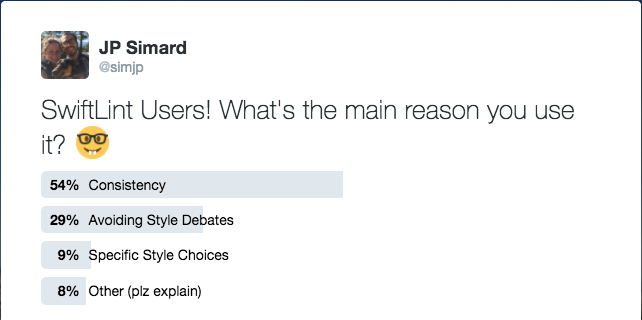

slidenumbers: true

# [fit] Watch Your
# [fit] **Language!**

## The road to clean code with SwiftLint

---

# What is **SwiftLint?**

### A tool to enforce Swift style and conventions


* Integrates into Xcode
* Plugins for AppCode, Vim, Sublime Text, Atom, Emacs

---

# Philosophy 🤔

> :fire: Code style is largely **unimportant**! :fire:
<br/>
> Which is why it's _crucial_ to **let tools do the pedantic formatting checks**
<br/>
> Allowing you to focus on more important aspects of writing code and building apps!

---

# GitHub Swift Style Guide

**[github.com/github/swift-style-guide](https://github.com/github/swift-style-guide)**


---



---

# **Reasons** People Use **SwiftLint**

* Intra-Project Consistency
* Inter-Project Consistency
* Helping Beginners Avoid Bad Practices
* Readability
* Avoiding Style Debates
* Specific Style Choices

---

# **Reasons** People Use **SwiftLint**



^
Source: https://twitter.com/simjp/status/809535736613478400

---

# Rules

* 60 rules
* 16 opt-in
* 19 correctable
* 19 configurable settings

---

# **Stylistic** Rules

* **Attributes:** Rules to place attributes like `@objc` and `@testable`
* **Closure Parameter Position:** Where to place closure parameters
* **Syntactic Sugar:** Use syntactic sugar types: `[Int]` vs `Array<Int>`
* **Trailing Comma:** Avoid/Require trailing commas: `[1,2,3,]`
* **Empty Parentheses Trailing Closure:** `[].map() {}` vs `[].map {}`
* **Implicit Getter:** Read-only properties avoid using the `get` keyword

---

# **Hygienic** Rules

* **Function Body Length**
* **Type Body Length**
* **Line Length**
* **File Length**
* Name rules lengths

---

# **Convention** Rules

* **Empty Parameters:** Prefer `() ->` over `Void ->`
* **Void Return:** Prefer `-> Void` over `-> ()`
* **Legacy Constant:** Prefer `CGRect.infinite` over `CGRectInfinite`
* **Comma Spacing:** No space before and one after
* **Colon:** Should be next to the identifier when specifying a type
* **Type Name** / **Variable Name**

---

# **Code Smells** Rules (🔪🐴)

* **Force Try**
* **Force Unwrapping**
* **Force Cast**
* **Function Parameter Count:** Too many parameters might be a sign you should use a type to encapsulate
* **Cyclomatic Complexity:** Too high might be hard to reason about
* **Nesting:** Don't nest types/statements too deeply: Pyramid of **DOOM**

---

# **Bug Avoiding** Rules

* **Dynamic Inline:** `@dynamic` with `@inline(__always)` is undefined
* **Empty Count:** Prefer `isEmpty` over comparing `count` to 0
* **Weak Delegate:** Delegates should be weak to avoid reference cycles
* **Valid IBInspectable**
* **Private Unit Test**
* **Private Outlets**

---

# [fit] **Great**
# [fit] Rules :+1:

---

# **Empty Parameters** Rule

```swift
// Triggers
let abc: Void -> Void = {}
func foo(completion: Void -> Void)
func foo(completion: Void throws -> Void)
let foo: Void -> () throws -> Void)
// Corrections
let abc: () -> Void = {}
func foo(completion: () -> Void)
func foo(completion: () throws -> Void)
let foo: () -> () throws -> Void)
```

---

# **Void Return** Rule

```swift
// Triggers
let abc: () -> () = {}
func foo(completion: () -> ())
func foo(completion: () -> (   ))
let foo: (ConfigurationTests) -> () throws -> ())
// Corrections
let abc: () -> Void = {}
func foo(completion: () -> Void)
func foo(completion: () -> Void)
let foo: (ConfigurationTests) -> () throws -> Void)
```

---

# **Legacy CGGeometry** Rule

```swift
// Triggers
CGRectIsInfinite( rect )
CGRectStandardize( rect)
CGRectIntegral(rect )
CGRectInset(rect, 5.0, -7.0)
CGRectOffset(rect, -2, 8.3)
CGRectUnion(rect1, rect2)
CGRectIntersection( rect1 ,rect2)
// Corrections
rect.isInfinite
rect.standardized
rect.integral
rect.insetBy(dx: 5.0, dy: -7.0)
rect.offsetBy(dx: -2, dy: 8.3)
rect1.union(rect2)
rect1.intersect(rect2)
```

---

# **Closing Brace Spacing** Rule

```swift
// Triggers
[].map( { } )
// Corrections
[].map({ })
```

---

# [fit] **No So Great**
<br/>
# [fit] Rules :-1:

---

# **Opt-In** Rules

* A rule that can have many false positives (e.g. `empty_count`)
* A rule that is too slow
* A rule that is not general consensus or only useful in some cases (e.g. `force_unwrapping`, `missing_docs`)

---

# **Custom** Rules

```yaml
comments_space: # From https://github.com/brandenr/swiftlintconfig
    name: "Space After Comment"
    regex: "(^ *//\w+)"
    message: "There should be a space after //"
    severity: error
force_https: # From https://github.com/Twigz/Game
    name: "Force HTTPS over HTTP"
    regex: "((?i)http(?!s))"
    match_kinds: string
    message: "HTTPS should be favored over HTTP"
    severity: warning
double_space: # From https://github.com/IBM-Swift/Package-Builder
    include: "*.swift"
    name: "Double space"
    regex: "([a-z,A-Z] \s+)"
    message: "Double space between keywords"
    match_kinds: keyword
    severity: warning
```

---

# [fit] **Configuration:** `.swiftlint.yml`

```yaml
disabled_rules: # rule identifiers to exclude from running
  - colon
  - comma
  - control_statement
opt_in_rules: # some rules are only opt-in
  - empty_count
  - missing_docs
  # Find all the available rules by running:
  # swiftlint rules
included: # paths to include during linting. `--path` is ignored if present.
  - Source
excluded: # paths to ignore during linting. Takes precedence over `included`.
  - Carthage
  - Pods
  - Source/ExcludedFolder
  - Source/ExcludedFile.swift
```

^
Sample configuration settings

---

# Commands

```swift
/**** Regions ****/
// swiftlint:disable colon
let noWarning :String = ""
// swiftlint:enable colon
let hasWarning :String = ""
/**** Local ****/
// swiftlint:disable:next force_cast
let noWarning = NSNumber() as! Int
let hasWarning = NSNumber() as! Int
let noWarning2 = NSNumber() as! Int // swiftlint:disable:this force_cast
let noWarning3 = NSNumber() as! Int
// swiftlint:disable:previous force_cast
```

---

# Enforcement

* Xcode Build Phase
* Use in AppCode, Vim, Sublime Text, Atom, Emacs
* Travis has SwiftLint installed on their Xcode images
* Jenkins
* Hound CI
* HTML reporter

---

<br/>
<br/>
<br/>
<br/>
<br/>
<br/>

# [fit] **Auto-Correct/Auto-Format**


---

# **Usage** Strategies

* The **Incremental** Code **Stylist**
* The **Skeptic**
* The **Completionist**
* The **Commander** In **Chief**
* The **Vagabond**
* The **Sniper**

---

# The **Incremental** Code **Stylist**

* Start with lots of rules disabled or very loose thresholds
* Start with a small portion of your code base
* Slowly start fixing violations & enabling those rules
* Great for larger teams or projects


^
Source: https://unsplash.com/photos/A9QZqYWu1U8

---

# The **Skeptic**

* You "don't believe" in linters :wink:
* ...or rather the value they add to your project
* Just enable the most reliable / obvious of rules


^
Source: https://unsplash.com/photos/0LU4vO5iFpM

---

# The **Completionist**

* ENABLE ALL THE RULES!
* RUIN YOUR CODE TO CONFORM TO ALL RULES!
* LINT EVERY SINGLE FILE IN YOUR PROJECT!
* LINT ALL DAY EVERY DAY!
* ...srsly don't do dis... :pray:
* Just because a rule exists doesn't mean you should use it


^
Source: https://unsplash.com/photos/1-29wyvvLJA

---

# The **Commander** In **Chief**

* Use comment commands liberally throughout your code
    * `// swiftlint:disable one_rule_here`
    * `// swiftlint:enable another_rule_there`
* Doing this a little is fine
* Doing this a lot won't help you get the consistency in your project you're after


^
Source: https://unsplash.com/photos/sCdm5DiJb8w

---

# The **Vagabond**

* Occasionally revisit running SwiftLint on your code
* This is great if you don't want the burden and churn of always linting
* Of if you're prototyping something / exploring ideas and don't want distractions
* Can do this with SwiftLint as a whole, or with specific rules
* An additional config file is great for this: `.swiftlint_hard_mode.yml`


^
Source: https://unsplash.com/photos/VGOiY1gZZYg

---

# The **Sniper**

* Just enable a small number of very specific rules in your project to prevent very specific bugs to creep in
* Don't need to be bothered with pesky style rules
* You're a style master, always consistent, always readable code... or just don't care 🤷‍♀️


^
Source: https://unsplash.com/photos/HmMVzPlwM4E

---

# [fit] **Tips** 💡
# [fit] From The
# [fit] **Trenches**


^
Source: https://unsplash.com/photos/EkI9kedvfjA

---

<br/>
<br/>
<br/>
<br/>
<br/>
# [fit] Don't Bend To The
# [fit] **Will Of The Machines**


---

# Don't Bend To The **Will Of The Machines**

```swift
// Persist your data easily
let realm = try! Realm()
try! realm.write {
  realm.add(mydog)
}
```

> **User Comment:** _Its kind of ironic that Realm's first example in docs does not work with swiftlint._

---

# [fit] SwiftLint *Will* Be **Wrong!**
### <br/>
# [fit] _Being 100% right is a_
# [fit] _**compiler's** job_

---

# Don't Bend To The **Will Of The Machines**

* Disable Rules in Configurations
* Use Nested Configurations
* Disable Rules In Source Code

---

# Companies Using Swiftlint

* Kickstarter (OSS :tada:): **[github.com/kickstarter/ios-oss](https://github.com/kickstarter/ios-oss)**
* Lyft
* Khan Academy
* Tumblr
* Venmo
* IBM
* PSPDFKit (PDF Viewer)
* eBay Classifieds
* Groupon
* Domain.com.au

---

# OSS Projects Using Swiftlint

* Facebook SDK Swift: **[github.com/facebook/facebook-sdk-swift](https://github.com/facebook/facebook-sdk-swift)**
* ReduxKit: **[github.com/ReduxKit/ReduxKit](https://github.com/ReduxKit/ReduxKit)**
* Aerial: **[github.com/JohnCoates/Aerial](https://github.com/JohnCoates/Aerial)**
* LTMorphingLabel: **[github.com/lexrus/LTMorphingLabel](https://github.com/lexrus/LTMorphingLabel)**
* Moya: **[github.com/Moya/Moya](https://github.com/Moya/Moya)**

---

# Alternatives

* Swift Format: **[github.com/nicklockwood/SwiftFormat](https://github.com/nicklockwood/SwiftFormat)**
* `swift-format`: **[github.com/apple/swift/pull/3439](https://github.com/apple/swift/pull/3439)**
* Swimat: **[github.com/Jintin/Swimat](https://github.com/Jintin/Swimat)**
* SwiftClean: **[swiftcleanapp.com](http://www.swiftcleanapp.com)**
* Tailor: **[github.com/sleekbyte/tailor](https://github.com/sleekbyte/tailor)**

---

# :pray: Nearly 100 **Contributors!**

Aaron Daub, Aaron McTavish, Alex Culeva, Andrea Mazzini, Andrew Rahn, Andrius Janauskas, Angel Garcia, Ankit Aggarwal, Benjamin Otto, Berik Visschers, Bill Bagdon, Blair McArthur, Blaise Sarr, Brandon Kobilansky, Brian Hardy, Brian Lu, Brian Partridge, Carl Hill-Popper, Chris Eidhof, Craig Siemens, Cristian Filipov, Daniel Beard, Daniel Duan, Danilo Bürger, David Paschich, David Potter, David Rönnqvist, Denis Lebedev, Diogo Guimaraes, Eric Bailey, Eric-Paul Lecluse, Erik Aigner, EyreFree, Fabian Ehrentraud, Francisco Costa, George Woodham, Gilles Grousset, Goktug Yilmaz, HaloZero, Isaac Greenspan, J. Cheyo Jimenez, JP Simard, Jake Craige, Javier Hernández, John Estropia, Johnykutty Mathew, Jonas Schmid, Jonas Wippermann, Jorge Bernal, Josh Friend

---

# :pray: Nearly 100 **Contributors!**

Keith Smiley, Kepler Sticka-Jones, Krzysztof Rodak, Lars Lockefeer, M. Porooshani, Marcelo Fabri, Matt Taube, Matthew Ellis, Maurício Hanika, Michael Skiba, Michał Kałużny, Mickael Morier, NachoSoto, Nadohs, Neil Gall, Nikolaj Schumacher, Norio Nomura, Oleg Kokhtenko, Olivier Halligon, Patrick A Wallace, Philip Webster, Raphael Randschau, Reimar Twelker, Robin Kunde, Ruotger Deecke, Samuel E. Giddins, Samuel Giddins, Sarr Blaise, Savio Mendes de Figueiredo, Scott Hoyt, Sean Hussey, Sebastian Grail, Shipeng Xu, Stanislav Dombrovsky, Syo Ikeda, Tom Wilkinson, Tony Li, Will Fleming, Yasuhiro Inami, Yuya Tanaka, ZX, akirahrkw, bootstraponline, crimsonwoods, dbeard, freak4pc, michallaskowski, rohan, toshi0383, wbagdon

---

# Think of a Rule you'd like to see?

# **You Should Contribute Next!**

---

# [fit] Thank You!
# [fit] **Questions?**

### JP Simard, @simjp, realm.io
